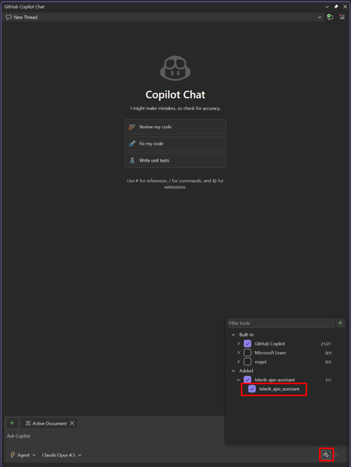

# Troubleshooting

This article provides solutions to common issues you may encounter when working with the Telerik UI for ASP.NET AJAX AI Coding Assistant.

## Hanging Tool Calls in Visual Studio

When using Telerik AI tools in Visual Studio, GitHub Copilot may:
* **hang** during tool invocation;
* show UI for a successful tool response, but actually **fail silently**;
* continue generation without waiting for **parallel tool calls**.

This is a [known issue](https://developercommunity.visualstudio.com/t/Copilot-stopped-working-after-latest-upd/10936456) in older Visual Studio versions that has been fixed in Visual Studio 18.3.0 Insiders (11426.168).

## AI Coding Assistant Stopped Working

Starting in January 2026, we restructured the Telerik UI for ASP.NET AJAX AI Coding Assisant to better serve different user needs. The AI Coding Assistant is now delivered through a single Telerik MCP server. 

License requirements have changed as follows:

* **DevCraft Complete Subscription or DevCraft Ultimate Subscription**&mdash;Provides full access to the AI Coding Assistant.
* **DevCraft UI Subscription, Telerik UI for ASP.NET AJAX Subscription**&mdash;Provide access to the AI Coding Assistant.
* **Perpetual licenses**&mdash;Do not grant access to any of the AI tools. You must have an active Subscription or trial license to use the Telerik MCP server.

For detailed information about license requirements and tool capabilities, see [License Requirements]().

## I Started a Trial License but Cannot Activate the MCP Server

When you activate a trial license, you must download and install the updated license key to enable access to the AI Tools. To resolve this issue:

1. Follow the steps in the [Setting up your license key]() section.
1. Restart your IDE to ensure the changes take effect.

The MCP server validates your license during initialization. Without a properly activated license key, the server cannot authenticate your access to the AI Tools.

## The MCP Server Tools Are Not Recognized by Visual Studio

If the Telerik MCP server tools are not available or recognized by GitHub Copilot in Visual Studio, you may need to manually enable them:

1. Click on the *Select Tools* button on the bottom right part of the Copilot chat window.
1. In the popup that opens, check the **telerik-ajax-mcp** from the list to enable it.

## See Also

* [Telerik MCP Server Installation]()
* [Licensing]()