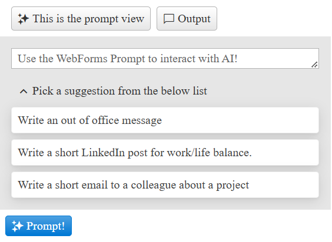

# Internationalization

The AIPrompt supports Internationalization by its `Messages` collection. The collection consists of text messages displayed in the component. Users can use this option to customize or localize the messages.

Example

````ASP.NET
<telerik:RadAIPrompt runat="server" ID="RadAIPrompt1" Width="400px">
    <Messages PromptView="This is the prompt view" GenerateOutput="Prompt!"
        PromptPlaceholder="Use the WebForms Prompt to interact with AI!" 
        PromptSuggestions="Pick a suggestion from the below list" />
</telerik:RadAIPrompt>
````



The available Messages can be found in the [Server Properties article]().

