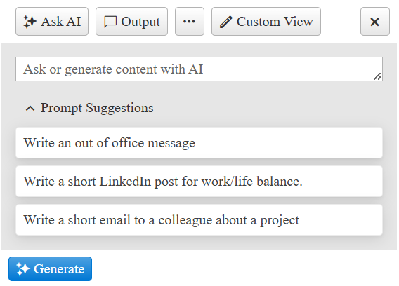

# Getting Started with the AIPrompt

This guide demonstrates how to get up and running with the Telerik WebForms AIPrompt.

After the completion of this guide, you will be able to achieve the following end result:



## Create the AIPrompt

To create the AIPrompt in the markup, add a `telerik:RadAIPrompt` element to the page.

````ASP.NET
<telerik:RadAIPrompt ID="RadAIPrompt1" runat="server" Width="400px" />
````

To create the AIPrompt on the server, create a new instance of the `RadAIPrompt` object, and add it to the Controls collection of another control (e.g. `PlaceHolder1`).

````C#
protected void Page_PreInit(object sender, EventArgs e)
{
    RadAIPrompt aiPrompt = new RadAIPrompt()
    {
        Width = Unit.Pixel(400),
    };

    PlaceHolder1.Controls.Add(aiPrompt);
}
````
````VB
Protected Sub Page_PreInit(ByVal sender As Object, ByVal e As EventArgs)
    Dim aiPrompt As RadAIPrompt = New RadAIPrompt() With 
        .Width = Unit.Pixel(400)
    }
    PlaceHolder1.Controls.Add(aiPrompt)
End Sub
````

The `PlaceHolder1`.

````ASP.NET
<asp:PlaceHolder ID="PlaceHolder1" runat="server"></asp:PlaceHolder>
````

>important Creating controls programmatically must be done in an early event such as **PreInit** (preferably), and **Init**. For more details you can check out the [ASP.NET Page Life-Cycle Events](https://learn.microsoft.com/en-us/previous-versions/aspnet/ms178472(v=vs.100)#life-cycle-events)

## Add Prompt Suggestions

The `PromptSuggestions` property is an array of strings to display in the prompt view. The suggestions can be clicked to populate the prompt input.

````ASP.NET
<telerik:RadAIPrompt ID="RadAIPrompt1" runat="server" Width="400px" PromptSuggestions="Suggestion 1, Suggestion 2, Suggestion 3" />
````

If you want to add more, lenghtly suggestions, it would be best to do that server-side:

````C#
protected void Page_Load(object sender, EventArgs e)
{
    if (!IsPostBack)
    {
        List<string> promptSuggestions = new List<string>
        {
            "Write an out of office message",
            "Write a short LinkedIn post for work/life balance.",
            "Write a short email to a colleague about a project",
        };

        string[] suggestionsArray = promptSuggestions.ToArray();
        RadAIPrompt1.PromptSuggestions = suggestionsArray;
    }
}
````
````VB
Protected Sub Page_Load(ByVal sender As Object, ByVal e As EventArgs)
    If Not IsPostBack Then
        Dim promptSuggestions As List(Of String) = New List(Of String) From {
            "Write an out of office message",
            "Write a short LinkedIn post for work/life balance.",
            "Write a short email to a colleague about a project"
        }
        Dim suggestionsArray As String() = promptSuggestions.ToArray()
        RadAIPrompt1.PromptSuggestions = suggestionsArray
    End If
End Sub
````

## Next Steps

- [Views]()
- [Toolbar Items]()
- [Integration with OpenAI API]()
- [Client-side Programming]()
- [Server-side Programming]()
