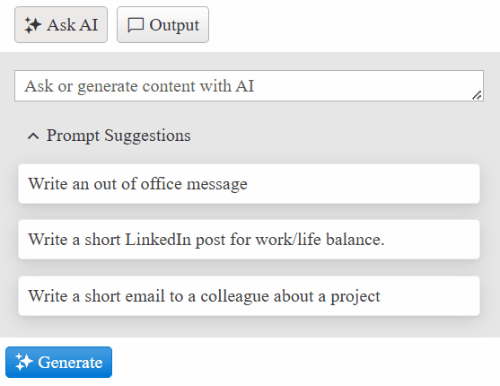

## Prompt Suggestion Item Template

The [PromptSuggestionItemTemplate](https://docs.telerik.com/kendo-ui/api/javascript/ui/aiprompt/configuration/promptsuggestionitemtemplate) allows you to customize the appearance of the prompt suggestion items in the prompt view.

````ASP.NET
<telerik:RadAIPrompt runat="server" ID="AIPrompt1" Width="350px">
    <PromptSuggestionItemTemplate>
        <span role="listitem" class="k-prompt-suggestion prompt-suggestion-item">#: suggestion #</span>
    </PromptSuggestionItemTemplate>
</telerik:RadAIPrompt>
````

````CSS
.prompt-suggestion-item {
    cursor: pointer;
    border: 1px solid #eaeaea;
    border-radius: 24px;
    margin: 3px;
    padding: 0.5rem;
    transition: transform 0.2s;
    box-shadow: rgba(149, 157, 165, 0.2) 0px 8px 24px;
}

.prompt-suggestion-item:hover {
    transform: scale(1.05)
}
````

````C#
protected void Page_Load(object sender, EventArgs e)
{
    if (!IsPostBack)
    {
        List<string> promptSuggestions = new List<string>
        {
            "Write an out of office message",
            "Write a short LinkedIn post for work/life balance.",
            "Write a short email to a colleague about a project",
        };

        string[] sentencesArray = promptSuggestions.ToArray();
        AIPrompt1.PromptSuggestions = sentencesArray;
    }
}
````
````VB
Protected Sub Page_Load(ByVal sender As Object, ByVal e As EventArgs)
    If Not IsPostBack Then
        Dim promptSuggestions As List(Of String) = New List(Of String) From {
            "Write an out of office message",
            "Write a short LinkedIn post for work/life balance.",
            "Write a short email to a colleague about a project"
        }

        Dim sentencesArray As String() = promptSuggestions.ToArray()
        AIPrompt1.PromptSuggestions = sentencesArray
    End If
End Sub
````



## Next Steps

- [ViewTemplate]()
- [FooterTemplate]()
