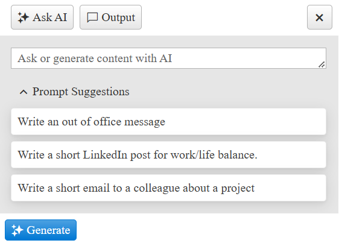

# Toolbar Items

The AIPrompt gives the user the option to add Toolbar Items that display in the header Toolbar. They will be rendered after the items generated from the configurations of the views.



## Options

- [Type](#type)          
- [Icon](#icon)          
- [Click](#click)         

### Type

Set the Type of the Toolbar Item. Available options are `Spacer` and `Button`.

### Icon

Sets the icon of the Toolbar Item. For a full list of icons, please check the [Progress Design System Kit](https://www.telerik.com/design-system/docs/foundation/iconography/icon-list/)

### Click

Set a function to the Toolbar Item.   

## Create Toolbar Items 

### In the Markup

````ASP.NET
<telerik:RadAIPrompt runat="server" ID="RadAIPrompt1" Width="400px">
    <ToolbarItems>
        <telerik:AIPromptToolbarItem Type="Spacer" />
        <telerik:AIPromptToolbarItem Type="Button" Icon="x" Click="onClick" />
    </ToolbarItems>
</telerik:RadAIPrompt>
````

### In the CodeBehind

````C#
protected void Page_Load(object sender, EventArgs e)
{
    if (!IsPostBack)
    {
        AIPromptToolbarItem toolbarItem = new AIPromptToolbarItem()
        {
            Type = AIPromptToolbarItemType.Spacer
        };

        RadAIPrompt1.ToolbarItems.Add(toolbarItem);

        toolbarItem = new AIPromptToolbarItem()
        {
            Type = AIPromptToolbarItemType.Button,
            Icon = "x",
            Click = "onClick"
        };

        RadAIPrompt1.ToolbarItems.Add(toolbarItem);
    }
}
````
````VB
Protected Sub Page_Load(ByVal sender As Object, ByVal e As EventArgs)
    If Not IsPostBack Then
        Dim toolbarItem As AIPromptToolbarItem = New AIPromptToolbarItem() With {
            .Type = AIPromptToolbarItemType.Spacer
        }

        RadAIPrompt1.ToolbarItems.Add(toolbarItem)

        toolbarItem = New AIPromptToolbarItem() With {
            .Type = AIPromptToolbarItemType.Button,
            .Icon = "x",
            .Click = "onClick"
        }

        RadAIPrompt1.ToolbarItems.Add(toolbarItem)
    End If
End Sub
````

````JavaScript
function onClick() {
    console.log("Click");
}
````

## Next Steps

- [Integration with OpenAI API]()
- [Client-side Programming]()
- [Server-side Programming]()
