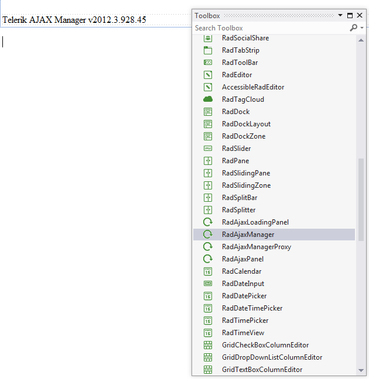
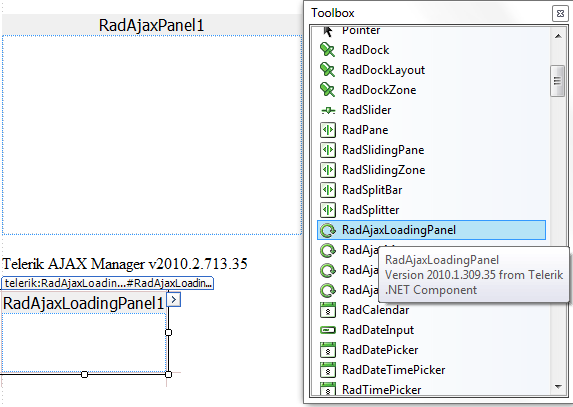
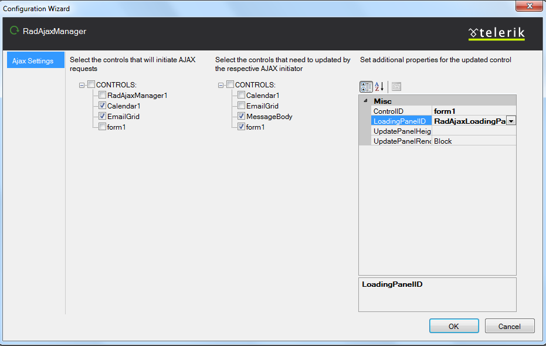
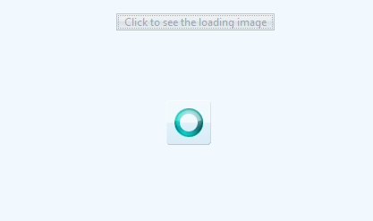

# Ajax-enable a Scenario through RadAjaxManager and RadAjaxLoadingPanel

## 

This page walks through the basic steps required to AJAX-enable an application using **RadAjaxManager** and **AjaxLoadingPanel**. You can add a **RadAjaxManager** control to any web application that requires the replacement of ordinary post backs with AJAX requests. AJAX-enabling a web application using **RadAjaxManager** is a completely codeless process. You can use an **AjaxLoadingPanel** enhance the user experience. **AjaxLoadingPanel**supports image templates, which your application can display as progress indicators whenever a callback request is performed, i.e., when the page is loading.

1. To add a **RadAjaxManager** to a web page that you are modifying in design view in Visual Studio, drag it from the Telerik toolbox (**Figure 1**) to the design surface.
>caption Figure 1: Dragging a RadAjaxManager from the Telerik toolbox to the design surface.

1. Next, drag and drop a **RadAjaxLoadingPanel** control from the Telerik toolbox to the design surface (**Figure 2**).
>caption Figure 2: Drag an RadAjaxLoadingPanel from the Telerik toolbox to the design surface.

1. To AJAX-enable the individual controls on the page, click on the box in the top right corner to open the Smart Tag and configure **RadAjaxManager** through the “**Open Ajax Settings Configuration Wizard**“ link of the Smart Tag (**Figure 3**). This step is completely codeless, requiring only design-time configuration of the necessary relations between the **RadAjaxManager** and the other controls:
>caption Figure 3: Click the link, Open Ajax Settings Configuration Wizard, to open the RadAjaxManager Configuration Wizard.

1. Now you should see the RadAjaxManager Configuration Wizard (**Figure 4**). On the left-hand side are controls that will initiate AJAX requests. In the center of the configuration wizard are controls that will be updated via AJAX. You can include and exclude items from these lists via the checkboxes to the left of each control name.
>caption Figure 4: The left and center parts of the RadAjaxManager Configuration Wizard let you set which controls initiate AJAX requests and which controls will be updated via AJAX.

1. You can display a loading panel for each control that will be updated via the **RadAjaxManager**. Set the **LoadingPanelID** property to the ID(**Figure 5**) of an existing **RadAjaxLoadingPanel** control:
>caption Figure 5: Set the LoadingPanelID to the ID of the RadAjaxLoadingPanel you just added.

1. **Figure 6** shows how the AJAX-enabled application looks at run-time. With the help of the **RadAjaxManager**, the normalpost back is replaced by a callback. The loading panel displays in the currently updating control:

# See Also

 * [What is AJAX?]()

 * [RadAjax Advantages]()
