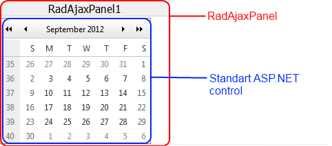

# RadAjaxPanel Overview


This help article describes the main features of the RadAjaxPanel, how to use it, and provides methods you can use if you need to use an external control to force RadAjaxPanel to perform an AJAX request. The __RadAjaxPanel__ control provides the easiest way to AJAX-enable ASP.NET web controls. You simply need to place the controls that you want Ajax-enabled into a __RadAjaxPanel__ and Telerik __RadAjax__ takes care of the rest. Best of all, this happens transparently to the framework and the controls that are being Ajax-enabled.

The main features of __RadAjaxPanel__ are:

* Ajax-enables all controls inside that normally work with postbacks.

* Defines visually and codeless (in Visual Studio design-time) which elements should be updated via AJAX requests. All elements wrapped in the panel will be updated via AJAX

* No need to modify your application logic

* Allows you to update a number of page elements at once

* No need to write any JavaScript or invoke AJAX requests manually

## RadAjaxPanel Usage

In Visual Studio at design time, if you want to Ajax-enable web controls on a page just add a __RadAjaxPanel__ to your page and then drag the controls you want to make callbacks into the __RadAjaxPanel__. Those controls will start performing callbacks instead of postbacks. __Figure 1__ shows a typical usage scenario. A standard ASP.NET Calendar control is placed in a __RadAjaxPanel__. On the web form there is also a [loading panel]() control that will be shown in place of the __RadAjaxPanel__ during the AJAX request.

>caution The whole __RadAjaxPanel__ (with __ALL__ controls inside) is updated when one of the controls makes an AJAX request. Thus, if you put the whole page into a __RadAjaxPanel__ , this may cause -reduced- performance, as -all- controls within the panel will be updated, -not- just the AJAX initiator.Placing the whole page into a __RadAjaxPanel__ is usable when you have a relatively small number of controls on the page.
>


__Out-of-Panel Update__

There are cases when you may want to update the controls inside a __RadAjaxPanel__ by triggering a callback externally from other control on the page.The following approach is not recommended as __RadAjaxManager__ can handle any complex scenarios. You can use asp:Panel controls and link them via __RadAjaxManager__'s settings. The same Panel may be set as both AJAX initiator and updated control, which will cause functionality similar to __RadAjaxPanel__.

You need to call the__$find(<%RadAjaxPanel1.ClientID%>).ajaxRequest()__ method (passing the necessaryinformation as parameters to it) and then override the __RaisePostBackEvent__ method or handle theRadAjaxPanel __AjaxRequest__ server-side event to apply the changes. __Example 1__ shows a sample implementation, which changes the background color of the panel.

__Example 1__: Use external control to update __RadAjaxPanel__

````ASPNET
	    <telerik:RadScriptManager ID="RadScriptManager1" runat="server">
	    </telerik:RadScriptManager>
	    <telerik:RadAjaxPanel ID="RadAjaxPanel1" runat="server" OnAjaxRequest="RadAjaxPanel1_AjaxRequest">
	    </telerik:RadAjaxPanel>
	    <telerik:RadCodeBlock ID="RadCodeBlock1" runat="server">
	        <script type="text/javascript">
	            function invokeAjaxrequest() {
	                $find("<%= RadAjaxPanel1.ClientID%>").ajaxRequestWithTarget("<%= RadAjaxPanel1.UniqueID %>", "ChangeColor");
	            }
	        </script>
	    </telerik:RadCodeBlock>
	    <input type="button" value="Change color" onclick="invokeAjaxRequest();" />
````


And in the code-behind:

>tabbedCode

````C#
	
	    protected void RadAjaxPanel1_AjaxRequest(object sender, AjaxRequestEventArgs e)
	    {
	        switch (e.Argument)
	        {
	            case "ChangeColor":
	                RadAjaxPanel1.BackColor = System.Drawing.Color.Maroon;
	                break;
	            default:
	                break;
	        }
	    } 
				
````


````VB.NET
	    Protected Sub RadAjaxPanel1_AjaxRequest(sender As Object, e As AjaxRequestEventArgs)
	        Select Case e.Argument
	            Case "ChangeColor"
	                RadAjaxPanel1.BackColor = System.Drawing.Color.Maroon
	        End Select
	    End Sub
````


>end

## ajaxRequestWithTarget() Reference

You can use any external control to force __RadAjaxPanel__ to perform an AJAX request by calling this client-side function. When using this function, the event target defaults to the __RadAjaxPanel__ instance.

>note You can construct the JavaScript function calls manually or alternatively use the server-side method[GetAjaxEventReference](http://www.telerik.com/help/aspnet-ajax/m_telerik_web_ui_radajaxcontrol_getajaxeventreference.html)and have Telerik RadAjax generate the necessary code for you.
>


|  ____doPostBack(eventTarget, eventArgument)__ or __$find("<%=RadAjaxPanel1.ClientID%>").ajaxRequestWithTarget(eventTarget, eventArgument)__  |  |
| ------ | ------ |
| __eventTarget__ |The control that should raise the postback event. You should use the control's __UniqueID__ .|
| __eventArgument__ |This is an optional argument for the event|


## ajaxRequest() Reference


>caption  

|  __$find("<%=RadAjaxPanel1.ClientID%>").ajaxRequest(arguments)__  |  |
| ------ | ------ |
| __arguments__ |The parameters the control used when it raised the request.|

When either of these functions is called on the client it can be handled in the AjaxRequest event handler on the server.

# See Also

 * [Overview]()

 * [Overview]()

 * [Demo: RadAjaxManager](http://demos.telerik.com/aspnet-ajax/ajax/examples/overview/defaultcs.aspx)

 * [Demo: RadAjaxPanel](http://demos.telerik.com/aspnet-ajax/ajax/examples/panel/firstlook/defaultcs.aspx)
