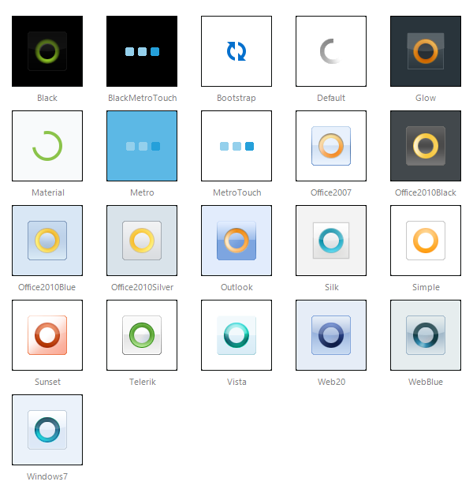

# Skins


This help article describes how **RadAjaxLoadingPanel** works with skins, shows a figure of the available skins, and describes how to work with transparency settings and the **BackgroundPosition** property.

As of Q1 2009, **RadAjaxLoadingPanel** supports skinning similar to all other controls in the UI for ASP.NET AJAX suite. You can change a **RadAjaxLoadingPanel's** skin by setting the **Skin** property to the name of the respective skin.

## 

>caution Unlike all other RadControls, for a **RadAjaxLoadingPanel** the **Skin** property's default value is "" (no skin). The main reason for this is backwards compatibility. If this was not the default setting, the appearance of all legacy loading panels will be spoiled and two loading images will appear.
>


**Built-in Skins**

**Figure 1** shows the embedded skins and what they look like for the **RadAjaxLoadingPanel** . They are embedded in the Telerik.Web.UI.dll assembly as web resources. To use a built-in skin you only need to set the **Skin** property of the control. You can find built-in skins in this folder: "C:\Program Files\Progress\UI for ASP.NET AJAX RX YYYY\Skins".

**Figure 1:** This figure shows the **RadAjaxLoadingPanel** using each of the embedded skins. 


 @[template - Material skin is available only in Lightweight mode](/_templates/common/skins-notes.md#material-only-in-lightweight) 


If the **Skin** property is set, the loading panel will NOT hide the updated control entirely, because transparency is applied by default from the skin. You can change this behaviour by setting **EnableSkinTransparency="false"** . Setting the **RadAjaxLoadingPanel** control's **Transparency** property will increase the actual visible transparency if the skin transparency is not disabled.

When the **Skin** property is set, the **RadAjaxLoadingPanel** control will render two nested <div> elements instead of one. This allows developers to use a non-transparent loading image and a transparent background.

The **RadAjaxLoadingPanel's** **BackgroundPosition** property enables the developer to position the loading image in the loading panel (**Top** , **TopRight** , **TopLeft** , **CenterLeft** , **Center** , **CenterRight** , **BottomLeft** , **Bottom** , **BottomRight** and **None** ). The default value is **Center** . Choosing **None** is useful in cases when the loading image is larger than the updated control (e.g. a textbox).

**Setting the Skin globally in the web.config file**

You can avoid setting the **Skin** property per each **RadAjaxLoadingPanel** instance and set it globally in the _web.config_ file:
````ASP.NET
<appSettings>
  <add key="Telerik.Ajax.Skin" value="Metro"  />
````

**Custom Skins**

Apart from using the embedded skins, you can easily create a custom skin for a **RadAjaxLoadingPanel** . A [code library example](https://www.telerik.com/community/code-library/aspnet-ajax/ajax/how-to-create-and-use-custom-skins-for-radajaxloadingpanel.aspx), demonstrates how to do that and provides some useful tips.

## See Also

 * [Overview]()

 * [Controlling Appearance of a RadAjaxLoadingPanel]()

 * [Demo: AjaxLoadingPanel](https://demos.telerik.com/aspnet-ajax/ajax/examples/loadingpanel/loadingimages/defaultcs.aspx)
