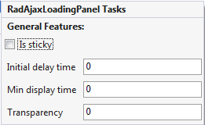

# Design Time

Display **Smart Tags** by right clicking the control and choosing **Show Smart Tag** from the context menu, or clicking the small rightward-pointing arrow located in the upper right corner of the control.

## RadAjaxLoadingPanel

>caption 

## General Features

* **Is Sticky** : If this option is checked, the panel will appear where you have placed it on your webform. If the option is not checked, the loading panel will appear in the place of controls being updated. The option is unchecked by default.

* **Initial Delay Time** : Specifies the delay in milliseconds, after which the loading panel will be shown.

* **Min Display Time:** Specifies the minimum time in milliseconds that the loading panel will be shown.

* **Transparency:** Is a value from 0 to 100 that indicates the transparency of the loading panel. A value of 0 will make the loading panel completely opaque and larger values will display the loading panel progressively more transparent.
