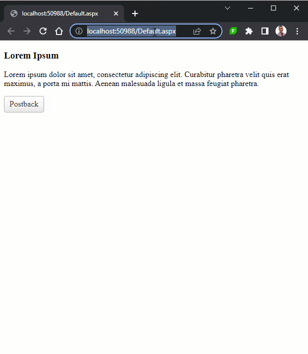

# Show AjaxLoadingPanel on Initial Page Load

Instructions to display **RadAjaxLoadingPanel** at Initial Page Load.

Although Telerik designed **RadAjaxLoadingPanel** so that you can display a progress indicator when an AJAX-enabled control updates, AJAX requests are triggered upon making PostBacks, however, you can also show the loading panel on initial page load as well. 

>caption DEMO



This functionality is not natively supported, however, the implementation is straightforward.

Overall, this example shows how to use the [Sys.Application.load Event](https://learn.microsoft.com/en-us/previous-versions/bb383829(v=vs.100)?redirectedfrom=MSDN) to trigger an **AJAX request** from the client by calling the [ajaxRequest(arguments)]() method of [RadAjaxManager]().


Key points:

- Add a nested `asp:Panel` with some content in it & set the **Visible** property to **False** for the inner `asp:Panel`
- Add RadAjaxLoadingPanel
- Add a RadAjaxManager
  - attach an event handler to its [AjaxRequest]() server event.
  - add the main panel (ID="Panel1") to the AjaxSettings and set the AjaxManager (ID="RadAjaxManager1") as the AjaxControl
  - add the main panel (ID="Panel1") to the AjaxSettings and set (ID="Panel1") as the AjaxControl
- Add a couple of CSS rules to apply height, width to the Panel as well a background-color to the AjaxLoadingPanel
- Add a ScriptBlock or CodeBlock containing the Script the will access the the [AjaxManager and will send an AjaxRequest]() in the [Sys.Application.load Event](https://learn.microsoft.com/en-us/previous-versions/bb383829(v=vs.100)?redirectedfrom=MSDN).

>caption Example

````ASP.NET
<telerik:RadAjaxManager ID="RadAjaxManager1" runat="server" OnAjaxRequest="RadAjaxManager1_AjaxRequest">
    <AjaxSettings>
        <telerik:AjaxSetting AjaxControlID="RadAjaxManager1">
            <UpdatedControls>
                <telerik:AjaxUpdatedControl ControlID="Panel1" LoadingPanelID="RadAjaxLoadingPanel1" />
            </UpdatedControls>
        </telerik:AjaxSetting>
        <telerik:AjaxSetting AjaxControlID="Panel1">
            <UpdatedControls>
                <telerik:AjaxUpdatedControl ControlID="Panel1" LoadingPanelID="RadAjaxLoadingPanel1" />
            </UpdatedControls>
        </telerik:AjaxSetting>
    </AjaxSettings>
</telerik:RadAjaxManager>

<style>
    .ajax-loading-panel {
        background-color: #808080;
    }
    .my-asp-panel {
        /*Set a height and width*/
        height: 600px;
        width: 600px;
    }
</style>

<asp:Panel ID="Panel1" runat="server" CssClass="my-asp-panel">
    <asp:Panel ID="Panel2" Visible="false" runat="server">
        <h3>Lorem Ipsum</h3>
        <p>Lorem ipsum dolor sit amet, consectetur adipiscing elit. Curabitur pharetra velit quis erat maximus, a porta mi mattis. Aenean malesuada ligula et massa feugiat pharetra.</p>
        <telerik:RadButton runat="server" ID="RadButton1" Text="Postback" AutoPostBack="true" OnClick="RadButton1_Click" />
    </asp:Panel>
</asp:Panel>

<telerik:RadAjaxLoadingPanel ID="RadAjaxLoadingPanel1" runat="server" Skin="Default" CssClass="ajax-loading-panel">
</telerik:RadAjaxLoadingPanel>

<telerik:RadScriptBlock ID="RadScriptBlock1" runat="server">
    <script type="text/javascript">
        function pageLoadHandler(sender, args) {
            if (!args.get_isPartialLoad()) {
                $find("<%= RadAjaxManager1.ClientID %>").ajaxRequest("InitialPageLoad");
             }
        }
        Sys.Application.add_load(pageLoadHandler);  
    </script>
</telerik:RadScriptBlock>
````

>caption C#/VB code for demonstration

````C#
protected void RadAjaxManager1_AjaxRequest(object sender, Telerik.Web.UI.AjaxRequestEventArgs e)
{
    if (e.Argument == "InitialPageLoad")
    {
        //simulate longer Page Load
        System.Threading.Thread.Sleep(2000);
        Panel2.Visible = true;
    }
}

protected void RadButton1_Click(object sender, EventArgs e)
{
    //simulate longer PostBack
    System.Threading.Thread.Sleep(2000);
}				
````
````VB
Protected Sub RadAjaxManager1_AjaxRequest(ByVal sender As Object, ByVal e As Telerik.Web.UI.AjaxRequestEventArgs)
	If e.Argument = "InitialPageLoad" Then
		'simulate longer Page Load
		System.Threading.Thread.Sleep(2000)
		Panel2.Visible = True
	End If
End Sub

Protected Sub RadButton1_Click(ByVal sender As Object, ByVal e As EventArgs)
	'simulate longer PostBack
	System.Threading.Thread.Sleep(2000)
End Sub
````


## See Also

- [Overview]()
 
