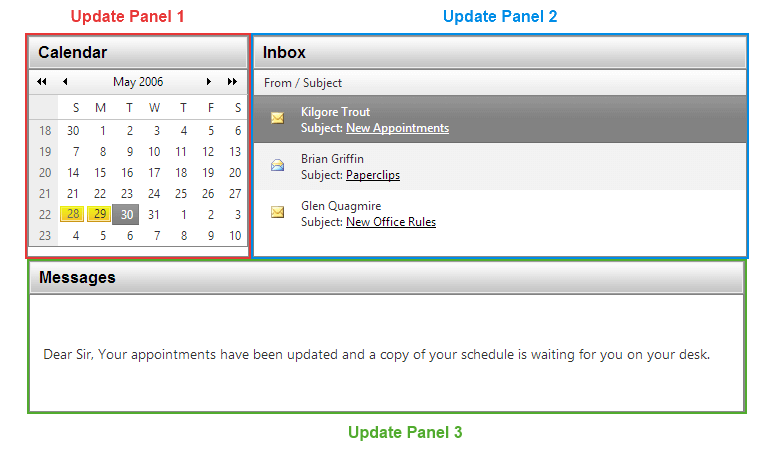

# AjaxManager Advantages

Using the AjaxManager control provides a number of benefits.

Among the many advantages for using the AjaxManager is that you don't need to make any changes to your existing applications, nor build new ones in some specific way so that they can be AJAX-enabled. 

The AjaxManager uses the Microsoft ASP.NET AJAX engine to Ajaxify applications but eliminates the need of using numerous UpdatePanels, triggers, and so on.

The click-and-Go™ technology of the AjaxManager allows you to AJAX-enable any ASP.NET application without making any modification or writing a single line of code. For more information, refer to the article on [AJAX and Telerik AJAX](). 

## Existing Applications

To AJAX-enable an existing application:

1. Add Microsoft ASP.NET AJAX to your project.

1. Drop an [AjaxManager]() to your form.

1. Define the AJAX relations by using a single dialogue in Visual Studio.

1. Press `F5` to run.

## New Applications 

To AJAX-enable new applications, you don't have to follow any specific guidelines. Build a regular postback-based application the way you are used to and use the [AjaxManager]() to AJAX-enable it at the end.

## AJAX-Enabling without the AjaxManager

When using Microsoft ASP.NET AJAX, the standard approach to AJAX-enable an application will require you to place `UpdatePanels` around each area that needs to be updated. This may introduce some challenges with preserving the application layout, that is, you need to figure out how to group the various elements. 

Consider the following example: it begins as an ASP.NET web page that has a calendar, an email list, and a message body control. When the user selects a date from the calendar, the e-mails that are received that day are shown in the grid. Once an e-mail is selected, its content is displayed in the message body.

>caption Add three UpdatePanels to AJAX-enable a page with Microsoft ASP.NET AJAX

In simple scenarios like the demonstrated one, placing `UpdatePanels` may not be very difficult. However, in real-life applications with dozens of UI controls that need to start working with AJAX, placing more than 20 `UpdatePanels` and figuring which element will go in the respective panel, may be a challenge even for the most advanced developers.

## AJAX-Enabling with the AjaxManager

The AjaxManager offers a fundamentally different approach for enabling AJAX on existing applications by dragging and dropping the control on your form and, then, setting the relations in a codeless way. 

>caption The AjaxManager designer when the Smart Tag is clicked

Once the AjaxManager is placed on the form, you need to use its configuration dialog to define the which controls will initiate AJAX requests and which controls will be updated by each respective AJAX request, for example:

* "Message Body" UpdatePanel - Trigger 1: The needs to be updated when an **e-mail item** is clicked.

* "Message Body" UpdatePanel - Trigger 2: The needs to be updated when the **calendar** is clicked.

* "E-mail list" UpdatePanel - Trigger 1: The needs to be updated when the **calendar** is clicked.

The combination of these three relation triggers defines the two AJAX relations on the page, which are:

1. When the **calendar** is clicked, the **e-mail list** and the **message body** need to be updated.

1. When an **e-mail message** is clicked, only the **message body** needs to be updated.

As you can see, it is not very easy to figure out what will be the effect of the combination of triggers, especially when you have complex real-life application. Moreover, setting several triggers that facilitate each AJAX relation will need serious planning and something like a "Trigger diagram". 

In contrast, the AjaxManager offers a centralized place where you can define and modify the AJAX relations on the page through the single configuration dialog in the Visual Studio .Net design-mode.

The logic for setting AJAX relations in the AjaxManager dialog brings about another benefit: the AJAX relations are defined in the same sequence in which users interact with the interface of the application.

## See Also

* [Adding the AjaxSettings Programmatically]()
