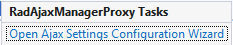

# Design Time

The AjaxManager delivers the **Smart Tags** options from the context menu. 

To display the **Smart Tags**, right-click the control and select **Show Smart Tag**, or click the small rightward-pointing arrow located in the upper right corner of the control.

The **Smart Tags** for the [AjaxPanel]() and [AjaxManager]() are nearly identical. The AjaxManager **Smart Tag** provides a **Configure Ajax Manager** link and a **Choose DefaultLoadingPanelID** drop-down list. The **Configure Ajax Manager:** displays the AjaxManager Property Builder.

>caption The AjaxManager Smart Tags options 

## General Features

* (Available in IE only) **Enable AJAX**&mdash;When this item is checked, all requests for controls managed by the [AjaxManager]() are handled with AJAX. If not checked, requests are handled in the legacy postback manner.

* **Enable AJAX History**&mdash;When checked, the browser history is enabled even when using AJAX. The **Forward** and **Back** buttons of the browser work as expected in a standard postback website.

* **Enable update of Page `<head>` element**&mdash;When checked, the `<Head>` element of the Page can be modified during AJAX updates.

* **Choose DefaultLoadingPanelID**&mdash;Select a [`LoadingPanel`]() instance from the drop-down list to display during AJAX updates.

## AJAX Resources 

* **Add RadAjaxManager...**&mdash;Adds an AjaxManager component to the form.

* **Replace ScriptManager with RadScriptManager**&mdash;Replaces the Microsoft Script Extensions ScriptManager with the Telerik ScriptManager. The Telerik ScriptManager provides enhanced capabilities for handling web resources and combining scripts for better performance.

* **Add RadStyleSheetManager**&mdash;Adds a StyleSheetManager to the web page. The Telerik StyleSheetManager provides enhanced capabilities for handling web resources and combining stylesheets for better performance.

## Learning Center

* The links navigate you directly to the examples, help sources, and the code library.

* You can also search the Telerik website for a given string.

* You can navigate directly to the [Telerik Support Center](https://www.telerik.com/support/home.aspx).

## AjaxManagerProxy

The **Configure Ajax Manager** option displays the AjaxManager Property Builder.

>caption The AjaxManagerProxy tasks

