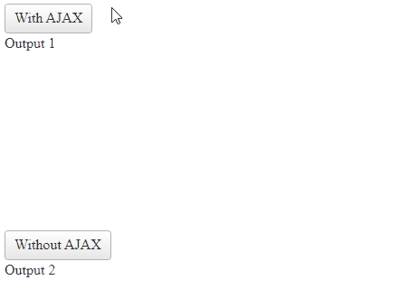

# Getting Started with the Telerik WebForms AjaxManager

This guide will walk you through the steps required to AJAX-enable an application by using the AjaxManager and the AjaxLoadingPanel. 

* First, you'll create your ASP.NET AJAX application and add the AjaxManager control to it. AJAX-enabling your web project with the AjaxManager will be a completely codeless process.
* Then, you will enhance user experience by defining the AjaxLoadingPanel control. Your web application will use one of its image templates and display it as a progress indicator whenever a callback request is performed, that is, when the page is loading.
* Finally, you will add some styling to the controls.

After the completion of this guide and as demonstrated in the following image, you will have an AJAX-enabled application at runtime in which the normal postback will be replaced by a callback, and the loading panel will be displayed in the currently updating control.



## Set Up Your ASP.NET Project

Before you add the AjaxManager to your application, ensure that you have a running ASP.NET project. The prerequisites to accomplish the installation of Telerik UI for ASP.NET are always the same, regardless of the Telerik AJAX control you want to use, and are fully described in the respective sections of the Getting Started guides: 

* [Installing Telerik UI for ASP.NET AJAX using MSI installer]()
* [Installing Telerik UI for ASP.NET AJAX from ZIP File](#prerequisites)
* [Installing Telerik UI for ASP.NET AJAX from NuGet feed](#prerequisites)

## Create an AJAX-Enabled Scenario

The following tutorial demonstrates how you can add the AjaxManager and AjaxLoadingPanel to a page, configuring two buttons to update a common container.

1. Add a ScriptManager control to a Web Form.


1. Add an AjaxManager to the page:


    ````ASP.NET
        <telerik:RadAjaxManager ID="RadAjaxManager1" runat="server"></telerik:RadAjaxManager>
    ````

1. Add an AjaxLoadingPanel to the page and associate the AjaxManager with it:


    ````ASP.NET

        <telerik:RadAjaxManager ID="RadAjaxManager1" runat="server" DefaultLoadingPanelID="RadAjaxLoadingPanel1">
        </telerik:RadAjaxManager>

        <telerik:RadAjaxLoadingPanel ID="RadAjaxLoadingPanel1" runat="server" Skin="Default"></telerik:RadAjaxLoadingPanel>
    ````
    

1. Add the controls that will be updated. In this sample, you will add two panels, two buttons, and two labels:


    ````ASP.NET
        <telerik:RadButton ID="RadButton1" runat="server" Text="With AJAX" OnClick="RadButton1_Click">
        </telerik:RadButton>
        <asp:Panel ID="Panel1" runat="server" Height="200px" Width="400px">
            <telerik:RadLabel ID="RadLabel1" runat="server">Output 1</telerik:RadLabel>
        </asp:Panel>

        <telerik:RadButton ID="RadButton2" runat="server" Text="Without AJAX" OnClick="RadButton2_Click">
        </telerik:RadButton>
        <asp:Panel ID="Panel2" runat="server" Height="200px" Width="400px">
            <telerik:RadLabel ID="RadLabel2" runat="server">Output 2</telerik:RadLabel>
        </asp:Panel>
    ````
    

1. Add a `RadButton1` to the AJAX initiators of the AjaxManager and register a `Panel1` to the controls that are updated by the button:


    ````ASP.NET
        <telerik:RadAjaxManager ID="RadAjaxManager1" runat="server" DefaultLoadingPanelID="RadAjaxLoadingPanel1">
            <AjaxSettings>
                <telerik:AjaxSetting AjaxControlID="RadButton1">
                    <UpdatedControls>
                        <telerik:AjaxUpdatedControl ControlID="Panel1" />
                    </UpdatedControls>
                </telerik:AjaxSetting>
            </AjaxSettings>
        </telerik:RadAjaxManager>
    ````
    

1. Add some server-side logic to the `OnClick` event handlers of the buttons to update the labels on the page:


    ````C#

        protected void RadButton1_Click(object sender, EventArgs e)
        {
            System.Threading.Thread.Sleep(2000); //added to simulate a longer AJAX request
            RadLabel1.Text = "Success";

            RadLabel2.Text = "Success"; //this label will not be updated
        }

        protected void RadButton2_Click(object sender, EventArgs e)
        {
            //the whole page will be updated
            RadLabel1.Text = "Success on Postback";
            RadLabel2.Text = "Success on Postback";
        }
    ````
    

    ````VB
        Protected Sub RadButton1_Click(ByVal sender As Object, ByVal e As EventArgs)
            System.Threading.Thread.Sleep(2000) 'added to simulate a longer AJAX request
            RadLabel1.Text = "Success"
            RadLabel2.Text = "Success" 'this label will not be updated
        End Sub

        Protected Sub RadButton2_Click(ByVal sender As Object, ByVal e As EventArgs)
            'the whole page will be updated
            RadLabel1.Text = "Success on Postback"
            RadLabel2.Text = "Success on Postback"
        End Sub
    ````


The final setup has to look like the following:

````ASP.NET
<telerik:RadAjaxManager ID="RadAjaxManager1" runat="server" DefaultLoadingPanelID="RadAjaxLoadingPanel1">
    <AjaxSettings>
        <telerik:AjaxSetting AjaxControlID="RadButton1">
            <UpdatedControls>
                <telerik:AjaxUpdatedControl ControlID="Panel1" />
            </UpdatedControls>
        </telerik:AjaxSetting>
    </AjaxSettings>
</telerik:RadAjaxManager>

<telerik:RadAjaxLoadingPanel ID="RadAjaxLoadingPanel1" runat="server" Skin="Default"></telerik:RadAjaxLoadingPanel>

<telerik:RadButton ID="RadButton1" runat="server" Text="With AJAX"
    OnClick="RadButton1_Click">
</telerik:RadButton>
<asp:Panel ID="Panel1" runat="server" Height="200px" Width="400px">
    <telerik:RadLabel ID="RadLabel1" runat="server">Output 1</telerik:RadLabel>
</asp:Panel>

<telerik:RadButton ID="RadButton2" runat="server" Text="Without AJAX"
    OnClick="RadButton2_Click">
</telerik:RadButton>
<asp:Panel ID="Panel2" runat="server" Height="200px" Width="400px">
    <telerik:RadLabel ID="RadLabel2" runat="server">Output 2</telerik:RadLabel>
</asp:Panel>
````

````C#
protected void RadButton1_Click(object sender, EventArgs e)
{
    System.Threading.Thread.Sleep(2000); //added to simulate a longer AJAX request
    RadLabel1.Text = "Success";
    
    RadLabel2.Text = "Success"; //this label will not be updated
}
protected void RadButton2_Click(object sender, EventArgs e)
{
    //the whole page will be updated
    RadLabel1.Text = "Success on Postback";
    RadLabel2.Text = "Success on Postback";
}
````
````VB
Protected Sub RadButton1_Click(ByVal sender As Object, ByVal e As EventArgs)
    System.Threading.Thread.Sleep(2000) 'added to simulate a longer AJAX request
    RadLabel1.Text = "Success"
    RadLabel2.Text = "Success" 'this label will not be updated
End Sub

Protected Sub RadButton2_Click(ByVal sender As Object, ByVal e As EventArgs)
    'the whole page will be updated
    RadLabel1.Text = "Success on Postback"
    RadLabel2.Text = "Success on Postback"
End Sub
````


## See Also

* [About AJAX and Telerik AJAX]()

