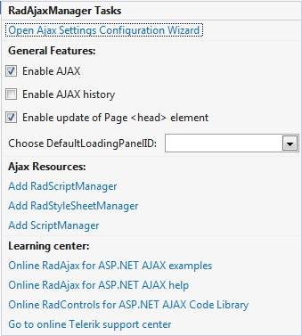

# Getting Started with the Telerik AjaxManager

This guide will walk you through the steps required to AJAX-enable an application by using the AjaxManager and the AjaxLoadingPanel. 

* First, you'll create your ASP.NET AJAX application and add the AjaxManager control to it. AJAX-enabling your web project with the AjaxManager will be a completely codeless process.
* Then, you will enhance user experience by defining the AjaxLoadingPanel control. Your web application will use one of its image templates and display it as a progress indicator whenever a callback request is performed, that is, when the page is loading.
* Finally, you will add some styling to the controls.

After the completion of this guide and as demonstrated in the following image, you will have an AJAX-enabled application at runtime in which the normal postback will be replaced by a callback and the loading panel will be displayed in the currently updating control.

## Step 1: Set Up Your ASP.NET Project

Before you add the AjaxManager to your application, ensure that you have a running ASP.NET project. The prerequisites to accomplish the installation of Telerik UI for ASP.NET are always the same, regardless of the Telerik AJAX control you want to use, and are fully described in the respective sections of the Getting Started guides: 

* [First Steps with Telerik AJAX by Installing with an MSI File]()
* [First Steps with Telerik AJAX by Installing with a ZIP File](#prerequisites)
* [First Steps with Telerik AJAX by Installing from a NuGet Package](#prerequisites)

## Step 2: Add the AjaxManager

To add the AjaxManager to a web page that you are modifying in the design view in Visual Studio, drag it from the Telerik toolbox to the design surface as shown in the following image.

>caption Drag the AjaxManager from the Telerik toolbox to the design surface

## Step 3: Add the AjaxLoadingPanel

To add the AjaxLoadingPanel to the project, drag and drop the control from the Telerik toolbox to the design surface as shown in the following image. 

>caption Drag the AjaxLoadingPanel from the Telerik toolbox to the design surface

## Step 4: AJAX-Enable the Controls

Now, let's AJAX-enable the individual controls on the page. To achieve this, you are only required to codelessly configure the necessary relations between the AjaxManager and the other control in the design-time: 

1. Click the box in the top right corner to open the **Smart Tag**.

1. Configure the AjaxManager through the **Open Ajax Settings Configuration Wizard** link of the **Smart Tag**. 

>caption Configure the relations between the controls 

1. On the left-hand side, the AjaxManager Configuration Wizard displays the controls that will initiate AJAX requests. In the center, the Configuration Wizard shows the controls that will be updated with AJAX. You can include and exclude items from these lists by selecting or deselecting the checkboxes to the left of each control.

>caption Select the controls that will initiate or will be updated by an AJAX request

## Step 5: Display a Loading Panel

You can now display a loading panel for each control that will be updated through the AjaxManager. Just set the `LoadingPanelID` property to the `ID` of an existing AjaxLoadingPanel control.

>caption Set the LoadingPanelID to the ID of the AjaxLoadingPanel 

## See Also

* [On AJAX and Telerik AJAX]()
