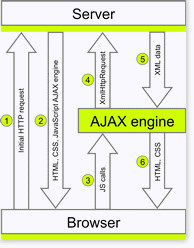

# What is AJAX

The core idea behind AJAX is to make the communication with the server asynchronous, so that data is transferred and processed in the background. As a result the user can continue working on the other parts of the page without interruption. In an AJAX-enabled application only the relevant page elements are updated and only when necessary.In contrast, the traditional synchronous (postback-based) communication requires a full page reload each time data is transferred to/from the server. This leads to the following negative effects:

* **Poor Interactivity** - the user interaction with the application is interrupted by a postback every time a server call is needed.

* **Ineffectiveness** - the full page is rendered and transferred to the client on each postback. This process is time consuming and traffic intensive.

* **Low Usability** - the requirement for full page postback whenever the user interface is changed imposes hefty limitations on the degree of sophistication a web user interface can achieve. Before AJAX, rich and smooth interfaces with on-demand updates could only be implemented using Flash technology.

AJAX-enabled applications, on the other hand, rely on a new asynchronous method of client-server communication. It is implemented as a JavaScript engine that is loaded on the client during the initial page load. From there on, this engine serves as a mediator that sends only relevant XML-formatted data to the server and subsequently processes the server response to update the relevant page elements.

Below is a diagram of the complete lifecycle of an AJAX-enabled web form.

1. Initial request by the browser – the user requests a particular URL

1. The complete page is rendered by the server (along with the JavaScript AJAX engine) and sent to the client (HTML, CSS, JavaScript AJAX engine)

1. All subsequent requests to the server are initiated as function calls to the JavaScript engine

1. The JavaScript engine then makes an XmlHttpRequest to the server

1. The server processes the request and sends a response in XML format to the client (XML document). It contains the data only of the page elements that need to be changed. In most cases this data comprises just a fraction of the total page markup

1. The AJAX engine processes the server response, updates the relevant page content or performs another operation with the new data received from the server. (HTML + CSS)

AJAX development however is a quite complex process. It requires:

* Intensive JavaScript coding - this may turn to be a problem for a large number of .Net developers. Furthermore, the lack of good debugging tools for client-side script makes the process even more complicated

* Comprehensive knowledge of the ASP.NET page lifecycle - AJAX applications typically break the normal page life-cycle and do not work properly. As a result developers have to handle ViewState management, EventValidation, and preservation of client-scripts

The Telerik RadAjax framework eliminates those challenges. The product features Telerik Click-and-Go™ patent-pending technology, which allow you to jump-start your AJAX development today:

* AJAX-enable any existing or new application, regardless of its level of complexity

* You don't need detailed knowledge of AJAX

* You don't have to modify your application - you do not need to place Update Panels, set triggers, manually invoke AJAX requests, etc.

* You don't have to write a single line of code (JavaScript or server-side)
