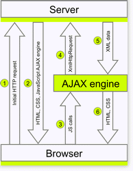

# About AJAX and Telerik AJAX 

AJAX is one of the main techniques for web programming. The AJAX communication technique allows you to add a nice finishing touch to your application by drastically improving the performance of the operations and by seamlessly implementing a client-side type of responsiveness for server-side operations. 

# What is AJAX

The core idea behind AJAX is to make the communication with the server asynchronous, so that the data is transferred and processed in the background. As a result, the user can continue working on the other parts of the page without interruption. 

In an AJAX-enabled application and only when necessary, only the relevant page elements are updated. In contrast, the traditional synchronous (postback-based) communication requires a full page reload each time data is transferred to or from the server. 

The postback-based data transfer leads to the following drawbacks:

* Poor interactivity&mdash;The user interaction with the application is interrupted by a postback every time a server call is needed.

* Ineffectiveness&mdash;The full page is rendered and transferred to the client on each postback. This process is time-consuming and traffic-intensive.

* Low usability&mdash;The requirement for a full-page postback whenever the user interface changes, imposes hefty limitations on the degree of sophistication a web user interface can achieve. Before AJAX, rich and smooth interfaces with on-demand updates could only be implemented by using the Flash technology.

AJAX-enabled applications, on the other hand, rely on a new asynchronous method of client-server communication. That communication is implemented as a JavaScript engine that is loaded on the client during the initial page load. From there on, this engine serves as a mediator that sends only relevant XML-formatted data to the server and subsequently processes the server response to update the relevant page elements.

## Visual Representation

The following diagram shows the complete lifecycle of an AJAX-enabled web form.

* **1**&mdash;Represents the initial request by the browser, that is, the user requests a particular URL.

* **2**&mdash;The complete page is rendered by the server (the JavaScript AJAX engine) and then sent to the client (the HTML, CSS, JavaScript AJAX engine).

* **3**&mdash;All subsequent requests to the server are initiated as function calls to the JavaScript engine.

* **4**&mdash;The JavaScript engine then makes an XmlHttpRequest to the server.

* **5**&mdash;The server processes the request and sends a response in an XML format (XML document) to the client. The response contains the data only of the page elements that need to be changed. In most cases, this data comprises of only a fraction of the total page markup.

* **6**&mdash;The AJAX engine processes the server response, updates the relevant page content, or performs another operation with the new data received from the server (HTML and CSS).

## AJAX Development Requirements

The AJAX development is a complex process and poses the following requirements:

* Intensive JavaScript coding&mdash;Sometimes the lack of good debugging tools for client-side scripts makes the process more complicated.

* Comprehensive knowledge of the ASP.NET page lifecycle&mdash;AJAX applications typically break the normal page lifecycle and do not work properly. As a result, developers have to handle the `ViewState` management, and the `EventValidation` and preservation of client scripts.

## Where Telerik AJAX Comes In

The Telerik AJAX framework eliminates the AJAX development challenges. The product allows you to jump-start your AJAX development immediately as it features the Telerik Click-and-Go™ patent-pending technology:

* Telerik AJAX allows you to AJAX-enable any existing or new application, regardless of its level of complexity.

* You don't need detailed knowledge of AJAX.

* You don't have to modify your application as you don't need to place update panels, set triggers, manually invoke AJAX requests, and the like.

* You don't have to write a single line of JavaScript or server-side code. 

## About Telerik AJAX

Telerik UI for ASP.NET AJAX delivers the AjaxManager, AjaxPanel and AjaxLoadingPanel which handle the Ajaxification of the controls located on the pages of your project.

### Using the AjaxPanel

The AjaxPanel is a wrapper for the UpdatePanel and provides a quick way to enable AJAX for all controls on the page, or for as many are wrapped into it. The AjaxPanel is designed to enable AJAX for all Controls that are placed inside it and does not provide the option to specify Triggers for Controls that reside outside.

### Using the AjaxManager

The AjaxManager may seem a little complicated at first, but it is simple and easy to understand once you know more about its background.

PostBack Triggers of the standard UpdatePanel are playing an important role. Therefore, Telerik has designed the AjaxManager to allow you to specify which Control to trigger the partial PostBack and update the other. When using the AjaxManager, you can update any control on the page, regardless of its location there. 

### Using the AjaxManagerProxy

Normally, you can only have one AjaxManager on a page. However, if you are using a combination of a MasterPage, a ContentPage, and UserControls, it is recommended that you utilize the AjaxManagerProxy. In this way, you can have different AJAX settings on each content page that are specific to the controls which are placed there.

## Learning Resources 

* [Understanding AJAX Controls]()
* [AJAX Programming (Wikipedia)](https://en.wikipedia.org/wiki/Ajax_(programming))
* [Telerik UI for ASP.NET AJAX Virtual Classroom (Training Courses for Registered Users)](https://learn.telerik.com/learn/course/external/view/elearning/5/telerik-ui-for-aspnet-ajax)
* [Online Demos for Telerik UI for ASP.NET AJAX ](https://demos.telerik.com/aspnet-ajax)
* [Installing Telerik UI for ASP.NET AJAX with MSI installer]()
* [Installing Telerik UI for ASP.NET AJAX from ZIP]()
* [Installing Telerik UI for ASP.NET AJAX from NuGet feed]()
