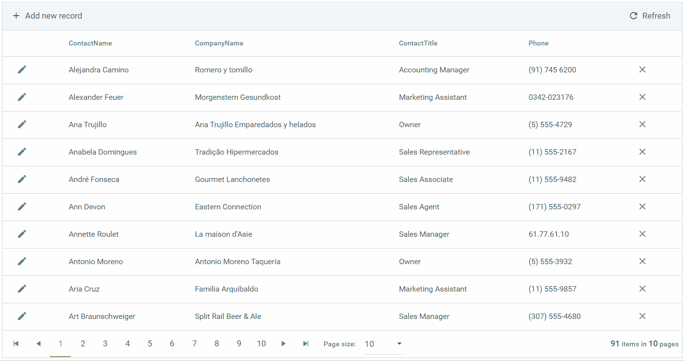

# RadAjaxManager Overview


AJAX is one of the main techniques of Web Programming which allows you to add a nice finishing touch to your application - by improving the performance drastically and make the server-side operations to have a similar responsiveness just as client-side functions. 

And here comes the role of the **RadAjaxManager** component - it powers developers to rapidly configure practical and complex AJAX solutions in their project.



**Figure 1** - RadAjaxManager in Action with RadGrid paging - together with RadAjaxLoadingPanel for visual indication


## Main Features

The main features of **RadAjaxManager** are:

* **Availibility** - You can AJAX-enable all controls that normally work with postbacks. 

* **Design-time UI support** - It lets you define visually and codeless (in Visual Studio design-time) which controls should initiate AJAX requests and which controls should be updated.

* **Convenience** - You do not need to modify your application logic.

* **Practicality** - You can update a number of page elements at once regardless of their position on the page.

* **Efficiency** - You do not need to write any JavaScript or invoke AJAX requests manually.

Using a single **RadAjaxManager** on the page you can create complex web applications, such as Microsoft Outlook® Web Access portal:

[Telerik Web Mail Demo](https://demos.telerik.com/aspnet-ajax/webmail/)

## Quick Example

Here is an example you can simply copy-paste to your project to see the prowess of AJAX:  
```markdown
<telerik:RadAjaxManager ID="RadAjaxManager1" runat="server">
    <AjaxSettings>
        <telerik:AjaxSetting AjaxControlID="RadButton1">
            <UpdatedControls>
                <telerik:AjaxUpdatedControl ControlID="RadLabel1" />
            </UpdatedControls>
        </telerik:AjaxSetting>
    </AjaxSettings>
</telerik:RadAjaxManager>
<telerik:RadButton ID="RadButton1" runat="server" Text="With AJAX"
    OnClick="RadButton1_Click">
</telerik:RadButton>
<telerik:RadLabel ID="RadLabel1" runat="server">Output 1</telerik:RadLabel>
<br />
<telerik:RadButton ID="RadButton2" runat="server" Text="Without AJAX"
    OnClick="RadButton2_Click">
</telerik:RadButton>
<br />
<telerik:RadLabel ID="RadLabel2" runat="server">Output 2</telerik:RadLabel>
```
```csharp
protected void RadButton1_Click(object sender, EventArgs e)
{
    RadLabel1.Text = "Success";
}
protected void RadButton2_Click(object sender, EventArgs e)
{
    RadLabel2.Text = "Success";
}
```
```vbnet
Protected Sub RadButton1_Click(ByVasender As Object, ByVal e As EventArgs)
    RadLabel1.Text = "Success"
End Sub
Protected Sub RadButton2_Click(ByVasender As Object, ByVal e As EventArgs)
    RadLabel2.Text = "Success"
End Sub
```


## Using in Projects

In order to use **RadAjaxManager**, it is sufficient to just drag it from the **Visual Studio** toolbox to your page.

>note It is sufficient to have just one **RadAjaxManager** in a single page.
>

If you are using MasterPage or WebUserControl scenario, the best option is to use a single **RadAjaxManager** on the master/main page and have a **RadAjaxManagerProxy** control on the content/ascx pages: 
* [RadAjaxManagerProxy Overview]()
* [RadAjax and MasterPage]()
* [RadAjax and WebUserControls]()

>caution It is a nice practice to implement AJAX last in your app. The reason behind this is that [AJAX tends to hide server and client-side errors](https://www.telerik.com/support/kb/aspnet-ajax/ajaxmanager/details/get-more-descriptive-errors-by-disabling-ajax).
>

## Capabilities

The visual designer of **RadAjaxManager** , accessible in Visual Studio, lets you set even the most complicated update scenarios such as the one shown in **Figure 2** :


**Figure 2** - Example of scenario with Ajax-enabled controls

1. Single control updates one or more controls with an AJAX request – **1** updates **2** and **3**

2. Second control updates other controls (or even controls from the previous scenario) with an AJAX request – **3** updates **2** and **5**

3. A control updates itself with an AJAX request – **6** updates **6** (i.e., itself)

4. Call the **RadAjaxManager** API from a control on the page and update control(s) on the page. – Using the **RadAjaxManager** API, **2** is made to update **1** and **4** .


## See Also
 * [Getting Started - What is AJAX?]()

 * [First Steps with UI for ASP.NET AJAX]()

 * [RadAjaxManagerProxy Overview]()

 * [RadAjaxManager Client-side programming Overview]()
 
 * [Controls Wrapped in AjaxPanel and Added to AjaxManager Settings]()
 
 * [RadAjaxManager Overview demo](https://demos.telerik.com/aspnet-ajax/ajaxmanager/overview/defaultcs.aspx)

