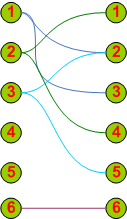

# RadAjaxManager Overview

**RadAjaxManager** is one of the two major controls of the UI for ASP.NET AJAX. The other one is [AJAX Panel](). **RadAjaxManager** allows developers to rapidly develop powerful and complex AJAX solutions.

The main features of **RadAjaxManager** are:

* You can AJAX-enable all controls that normally work with postbacks.

* It lets you define visually and codeless (in Visual Studio design-time) which controls should initiate AJAX requests and which controls should be updated.

* You do not need to modify your application logic.

* You can update a number of page elements at once regardless of their position on the page.

* You do not need to write any JavaScript or invoke AJAX requests manually.

Using a single **RadAjaxManager** on the page you can create complex web applications like Microsoft Outlook ® Web Access portal.

The visual designer of **RadAjaxManager** , accessible in Visual Studio, lets you set even the most complicated update scenarios such as the one shown in **Figure 1** :

**Figure 1** - Example of scenario with Ajax-enabled controls

1. Single control updates one or more controls with an AJAX request – **1** updates **2** and **3**

2. Second control updates other controls (or even controls from the previous scenario) with an AJAX request – **3** updates **2** and **5**

3. A control updates itself with an AJAX request – **6** updates **6** (i.e., itself)

4. Call the **RadAjaxManager** API from a control on the page and update control(s) on the page. – Using the **RadAjaxManager** API, **2** is made to update **1** and **4** .

In order to use **RadAjaxManager** , you need to drag it from the **Visual Studio** toolbox to your page.

>caution Note that you cannot have two **RadAjaxManagers** in a single page. If you are using **MasterPage** or **WebUserControl** , the best option is to use a single **RadAjaxManager** on the master/main page.
>

## See Also

 * [Overview]()

 * [Overview]()
