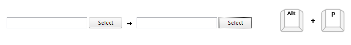
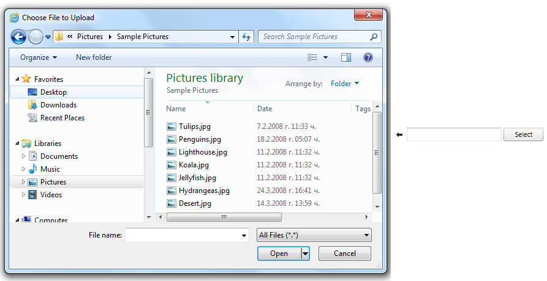

# Keyboard Support

##

A critical requirement for software accessibility is keyboard support as a complete alternative to pointing devices (mouse, etc.). Keyboard support is comprised of navigation key, command key, keyboard navigation, and action keys. **RadAsyncUpload** seamlessly switches between mouse and keyboard navigation. As a part of **Q2 2013** **RadAsyncUpload** control introduced fully built-in keyboard support.

## KeyboardNavigationSettings

Setting the control's **KeyboardNavigationSettings** (*introduced in R2 2016 - ver.2016.2.504*), allows you to associate an activation combination (**CommandKey** + **FocusKey**), which moves focus directly to the **RadAsyncUpload** and enables keyboard navigation. When there are multiple **AsyncUpload** controls on a given page, each of them may have a different activation combination.

The **KeyboardNavigationSettings** exposes two properties to configure the keyboard combination that sets focus to the control:

* **FocusKey**: An upper-case letter or number.

* **CommandKey**: [Ctrl] , [Alt] or [Shift].

Pressing the keys set to these two properties at the same time places the focus on the AsyncUpload. The user can then use the **action keys** for triggering specific action or the [Tab] key for navigation.

**Example 1**: Setting the **KeyboardNavigationSettings** for **RadAsyncUpload**

````ASPNET
<telerik:RadAsyncUpload RenderMode="Lightweight" ID="RadAsyncUpload1" runat="server" >
    <KeyboardNavigationSettings CommandKey="Alt" FocusKey="P" />
</telerik:RadAsyncUpload>
````



>note Note that in some browsers certain keyboard combinations are already occupied and used by the browser itself.
>

>note To enable keyboard support for Internet Explorer 9 or earlier, you will have to set the **DisablePlugins** property to **true** .
>


## Action keys

**RadAsyncUpload** uses [Space] key to activate the "File Upload" dialog window.




## Moving through the files list

**RadAsyncUpload** allows end-users to navigate through the selected files structure using the [Tab] and [Shift] + [Tab]. To delete a file from the list the user should press [Enter] while focus is on the respective file:


# See Also

 * [Getting Started]()

 * [Skins]()

 * [Localizing RadAsyncUpload]()
