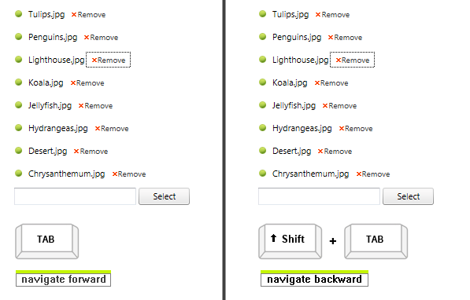

# Keyboard Support

## 

As a part of Q2 2013 **RadAsyncUpload** control introduced fully built-in keyboard support. The following code snippet describes how you can use the keyboard support with the **RadAsyncUpload** control.

````ASPNET
<telerik:RadAsyncUpload ID="RadAsyncUpload1" runat="server" AccessKey="P" TabIndex="1"/>
````

* **Access Keys** - You can specify a key that lets the end-users to move focus directly to the **RadAsyncUpload**. Once focus is on the **RadAsyncUpload**, the user can use the Tab key for navigation. The access key is defined using the **AccessKey** property. For example, if you set the **AccessKey** property to "P", focus moves to the **RadAsyncUpload** when the user press "Alt+P".

* **Key Navigation**- **RadAsyncUpload** allows end-users to navigate the selected files structure using the Tab and Shift + Tab:

* **Action Key** - **RadAsyncUPload** uses "Spacebar" or the "Enter" key to activate the "File Upload" dialog window.

>note To enable the keyboard support for Internet Explorer 9 or earlier, you will have to set the **DisablePlugins** property to **true** .
>When using Internet Explorer, you need to press Tab key twice, in order to move focus to next control on the page. This is a browser behavior.
>


>caption  Key combinations supported by different browsers 

| Browser | Focus | Action Key | Navigation Forward | Navigation Backward |
| ------ | ------ | ------ | ------ | ------ |
| **Internet Explorer** |Alt + **Access Key** |Space|Tab|Shift + Tab|
| **Firefox** |Alt + Shift + **Access Key** |Space|Tab|Shift + Tab|
| **Chrome** |Alt + **Access Key** (Alt + Shift + **Access Key** )|Space (Enter)|Tab|Shift + Tab|
| **Safari** |Alt + **Access Key** (Alt + Shift + **Access Key** )|Space (Enter)|Tab|Shift + Tab|
| **Opera** |Not Supported|Space (Enter)|Tab|Shift + Tab|

# See Also

 * [Getting Started]()

 * [Skins]()

 * [Localizing RadAsyncUpload]()
