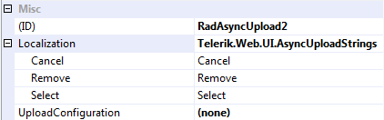
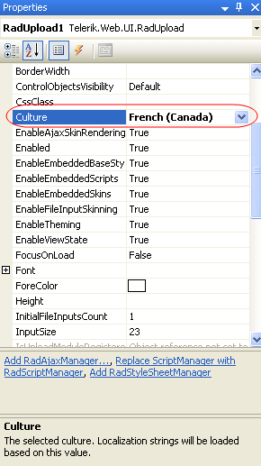

# Localizing RadAsyncUpload


The localization support for __RadAsyncUpload__ lets you translate the user interface, or simply adapt a few strings. This article provides information on how you can use localization with the __RadAsyncUpload__ control.

## Localization Property

The __Localization__ property specifies the strings that appear in the runtime user interface of __RadAsyncUpload__. By changing the values of each named sub-property, you change the appearance of the string the upload uses:

````ASPNET
<telerik:radasyncupload id="RadAsyncUpload1" runat="server" localization-select="Select zip file" />
````



>note This technique is useful when customizing some of the messages of a particular instance. The messages are not shared between upload instances. A complete translation using this approach is not appropriate.
>

>caption  

| Property Name | Default Value | Description |
| ------ | ------ | ------ |
| __Add__ |Add|Sets the text of the __Add__ button.|
| __Remove__ |Remove|Sets the text of the __Remove__ button.|
| __Select__ |Select|Sets the text of the __Select__ button.|
| __DropZone__ |Drop files here|Sets the text of the __DropZone__ that appears when the file is about to be dropped (added Q3 2012 SP1).|

## Global Resource Files

The primary means for localization in ASP.NET is to use resource files. Resource files are simple XML files that can be easily edited and transferred to other applications. You can use resource files to change the default (English) localization for __RadUAsyncpload__ that is stored in the Telerik.Web.UI assembly.

To create a global resource file to localize the upload follow these steps:

1. Create the __App_GlobalResources__ folder in the root of your web application.

1. Copy the default resource __RadAsyncUpload.resx__ file into it. This file can be found in the App_GlobalResources folder of the directory where you installed the RadControls.

1. Make a copy of the file and rename the copy so that its name contains the Culture Identifier. The resource files used by __RadAsyncUpload__ follow a strict naming convention: __RadAsyncUpload.\<Culture Identifier\>.resx__

>note The __Culture Identifier__ consists of a language code followed by a dash and the country code. Example: “en-US”, “fr-CA” and so on.
>
For example* RadAsyncUpload.fr-CA.resx*. Both files should be present in the App_GlobalResources folder:

1. Edit the strings using the Visual Studio editor or your favorite text editor. Customize strings just as you would set the __Localization__ property.

>caution Make sure that the __ReservedResource__ message is preserved. It is used for identification purposes and is never displayed.
>
You can now switch the __RadAsyncUpload__ so that it uses your new resource file by setting the __Culture__ property:

# See Also

 * [Getting Started]()

 * [Keyboard Support]()

 * [RTL Support]()
