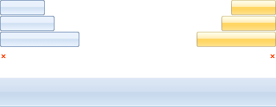

# Increase the Width of the Select Button

This help article describes how you can alter the width of the **Select** button of the **RadAsyncUpload** control.

## 

The picture below represents a sprite image that is currently used as a background for the **Select** button. To get the different colors of the button you will need get the correct CSS class selector that will allow you to move this sprite image to X and Y coordinates (e.g. background-position: 0 -46px).

In general, you have two ways that you can use to alter the width of the button:

* First, you can use the current sprite image and simply change the background-position:

````XML
div.RadUpload .ruBrowse
{
    background-position: 0 -23px;
    width: 79px;
}
div.RadUpload_Default .ruFileWrap .ruButtonHover
{
    background-position: 100% -23px !important;
}	
````

* Second, you can load your own picture for the background with the proper size and color by using the following CSS class:

````XML
/*RadAsyncUpload1 is your control's ID*/
#RadAsycnUpload1. RadUpload_Default .ruButton
{         
   /*it is an example URL*/ 
   background-image: url("images/ruSprite.png");
}	
````

# See Also

 * [Getting Started]()

 * [Skins]()

 * [Styling the Input Element]()
