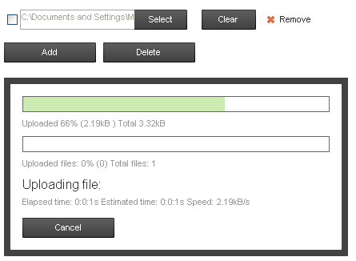
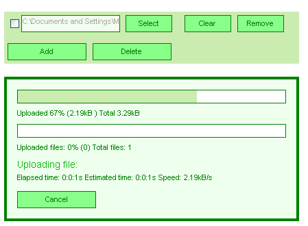
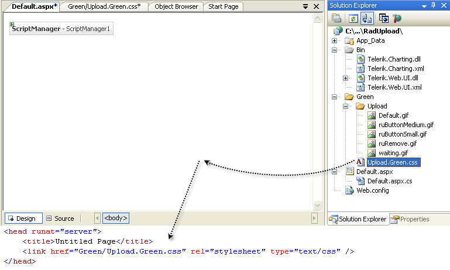

# Tutorial Creating a Custom Skin


The following tutorial demonstrates creating a custom __RadAsyncUpload__ skin, using the default skin as a base. This new skin will take the appearance of __RadAsyncUpload__ and __RadProgressDialog__ from their default look:



to something a little greener:



See [Understanding the Skin CSS File](C086A5D1-D48F-4412-89D4-DFECEB9AB9E4) for more information on specific CSS file properties.

## Prepare the Project

1. In the Solution Explorer, double-click the __Web.config__ file to open it for editing.

1. Under the __<configuration>__ element, locate the __<system.web>__ element. Add it if it does not exist.

1. Under the __<system.web>__ element, locate the __<httpModules>__ element. Add it if it does not exist.

1. In the __<httpModules>__ element, add the following tag to [ register RadUploadHttpModule ](http://www.telerik.com/help/aspnet-ajax/upload-configuration.html):

````XML
	    <add name="RadUploadModule" type="Telerik.Web.UI.RadUploadHttpModule, Telerik.Web.UI" />
````


1. Under the __<system.web>__ element, locate the __<httpHandlers>__ element. Add it if it does not exist.

1. In the __<httpHandlers>__ element, add the following tag to [ register RadUploadProgressHandler ](http://www.telerik.com/help/aspnet-ajax/upload-configuration.html):

````XML
	    <add verb="*" path="Telerik.RadUploadProgressHandler.ashx" type="Telerik.Web.UI.RadUploadProgressHandler, Telerik.Web.UI" />
````


1. At this point, your web.config should look as follows:

````XML
	    <configuration> 
	        ...
	        <system.web>
	            <httpHandlers>
	                <add verb="*" path="Telerik.RadUploadProgressHandler.ashx" type="Telerik.Web.UI.RadUploadProgressHandler, Telerik.Web.UI" />
	                 ... 
	            </httpHandlers>
	            <httpModules>
	                <add name="RadUploadModule" type="Telerik.Web.UI.RadUploadHttpModule, Telerik.Web.UI" />
	                ...    
	            </httpModules>
	                ...  
	        </system.web>
	    </configuration>
````


1. In the Solution Explorer, create a new "Green" directory in your project.

1. Copy the default __RadAsyncUpload__ skin files from the installation directory to the "Green" directory; copy both the __\AsyncUpload__directory that contains the images for this skin and the __AsyncUpload.Default.css__ file that defines the skin styles.

>note The file path will typically be similar to this example: *\Program Files\Telerik\<Your Version of RadControls for ASPNET>\Skins\Default.* 
>


1. In the Solution Explorer, rename __"AsyncUpload.Default.css"__to __"AsyncUpload.Green.css"__.

1. Open __Upload.Green.css__ and replace all instances of ___Default__ with ___Green__. Then save the file.

1. Drag the __"Upload.Green.Css"__ file from the Solution Explorer onto your web page. This automatically adds a reference to the page "<head>" tag as a "<link>" to the new style sheet:

1. Drag a __RadAsyncUpload__ control from the toolbox onto your webpage.

* Set the __ControlObjectsVisibility__ property to __All__.

* Set the __EnableEmbeddedSkins__ property to __false__.

* Change the __Skin__ property to __Green__.

1. Drag a __RadProgressManager__ control from the toolbox onto your webpage.

1. Drag a __RadProgressArea__ control from the toolbox onto your webpage.

* Set the __DisplayCancelButton__ property to __true__.

* Set the __EnableEmbeddedSkins__ property to __false__.

* Change the __Skin__ property to __Green__.

1. Drag a __Button__ from the toolbox onto your webpage.

* Change its __Text__ property to __Submit__.

* Assign the following __Click__ event handler so that you can easily see the Progress dialog box:

>tabbedCode

````C#
	     
							protected void Button1_Click1(object sender, EventArgs e){  if (RadUpload1.UploadedFiles.Count > 0)  {    System.Threading.Thread.Sleep(3000);  }}
				
````


````VB.NET
	     
							Protected Sub Button1_Click(ByVal sender As Object, ByVal e As EventArgs) _    Handles Button1.Click  If RadUpload1.UploadedFiles.Count > 0 Then    System.Threading.Thread.Sleep(3000)  End IfEnd Sub
				
````


>end

1. Press F5 to run the application. Select a file and click the __Submit__button. The new "Green" skin should look just like the default skin:

## CSS Classes for RadAsyncUpload

1. The skin CSS class that is applied to the <div> element which represents the rendered __RadAsyncUpload__ control is __RadUpload_Green__. (This is also the class applied to the <div> element for __RadProgressArea__.) All other style definitions in the CSS files are qualified by this class. Within that top-level <div> element is an unordered list <ul> element, that handles the layout of the __RadAsyncUpload__ control. This <ul> element has the __ruInputs__ class applied. The default skin does not have a selector for the __ruInputs__ class alone, which is why the default skin does not show the outlines of the entire __RadAsyncUpload__ control. Add such a selector to your style sheet, giving it the following rules:

````ASPNET
	    .RadUpload_Green .ruInputs { background:#cbecb0; padding: 5px 0 5px 5px;}
````


1. The input area is actually a composite of a standard file input element sitting over a text box and button control that together simulate a file input element. This is done so that the skin CSS file has more control over [styling the input area](C20E27FF-BE09-4381-BCF6-EE31EF611C42). The __ruFakeInput__ class is applied to the text box.Locate the rule for this element and change the border color to "green" and the background to "#eeffee":

````ASPNET
	    .RadUpload_Green .ruFakeInput 
	    { 
	        height:19px; 
	        border:1px solid green; 
	        margin-right:-1px;
	        padding-top:3px; color: #333; 
	        background: #eeffee;
	    }
````


1. All of the buttons in the __RadAsyncUpload__ control (and the __RadProgressArea__ control, as well) have the __ruButton__ class applied. Locate the selector for this class and add a green border, change the background from a URL to "#88ff88" and change the color to "green":

````ASPNET
	    .RadUpload_Green .ruButton 
	    { 
	        width:68px; 
	        height:25px; 
	        border:solid 1px green; 
	        margin-left:0.8em;
	        padding:0; 
	        background : #88ff88; 
	        color: green; 
	        text-align:center;
	    }
````


1. Each button has an additional class applied that is specific to that type of button. These classes include __ruCheck__, __ruBrowse__, __ruRemove__, __ruAdd__, and __ruDelete__. The "Green" style sheet is not going to do anything special for different button types, so locate the selectors for __.RadAsyncUpload_Green .ruBrowse__ and __.RadaAsyncUpload_Green .ruRemove__, and delete those class definitions.

1. The Add and Remove buttons appear inside a separate <li> element with the __ruActions__ class applied. Locate the __.RadUpload_Green .ruActions .ruButton__ selector. Remove the background rule from this class definition:

````ASPNET
	    .RadUpload_Green .ruActions .ruButton { width:115px; margin:0 0.8em 0 0;}
````


1. Press F5 to run the application. The __RadAsyncUpload__ control has its new appearance. Select a file and click the __Submit__ button. Note that some of your changes affect the __Cancel__ button in the progress dialog as well:

## CSS Classes for RadProgressArea

1. Like the __RadAsyncUpload__ control, the __RadProgressArea__ control is laid out using a <div> element with the __RadAsyncUpload_Green__ class applied, and within that by a <ul> element. In the case of __RadProgressArea__, however, the <ul> element has the __ruProgress__ class applied instead of the __ruInputs__ class. Locate the rule for this class, change the background color to "#efe", change the border to green, and reduce its width to 4px:

````ASPNET
	    .RadUpload_Green .ruProgress { border:4px solid Green; background:#efe; padding:15px;}
````


1. Locate the __RadAsyncUpload_Green .ruProgress li__ selector. This class is applied to the rows of the Progress dialog box. Change the color to "green":

````ASPNET
	    .RadUpload_Green .ruProgress li { margin:0 0 0.8em; color:green;}
````


1. Each row in the Progress dialog box has its own style class, which is assigned to the <li> element. Locate the element for the row with the current file name, which has the __ruCurrentFile__ class (__.radAsyncUpload_Green .ruProgress li.ruCurrentFile__). Change the color to "#0b0" and reduce the font-size to 14px:

````ASPNET
	    .RadUpload_Green .ruProgress li.ruCurrentFile { margin:0 0 0.3em; font-size:14px; color:#0b0;}
````


1. The name of the current file is rendered using a <span> element inside the <li> element for the row. Locate the __.radUpload_Green .ruProgress li.ruCurrentFile span__ selector. Use this rule to change the color to green and reduce the font size to 14 px:

````ASPNET
	    .RadUpload_Green .ruProgress li.ruCurrentFile span { font-size:14px; color:green;}
````


1. The progress bars are rendered using two nested <div> elements. The outer <div> has the __ruBar__ class applied. Locate the __.RadUpload_Green .ruProgress .ruBar__ selector. Change the border to green and add a white background:

````ASPNET
	    .RadUpload_Green .ruProgress .ruBar 
	    { 
	        margin-bottom:0.4em; 
	        border:1px solid green;
	        height:18px; 
	        background: white;
	    }
````


1. Press F5 to run the application to see the effect of your changes:

For more information about cascading style sheets (CSS), see

* [World Wide Web Consortium CSS specifications](http://www.w3.org/Style/CSS/)

* [W3 Schools CSS tutorial](http://www.w3schools.com/css/default.asp)

* [Guide to Cascading Style Sheets](http://www.htmlhelp.com/reference/css/)

# See Also

 * [Skins]()

 * [Increase the Width of the Select Button]()
