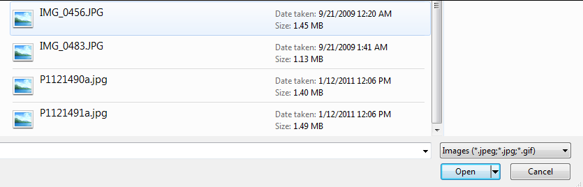
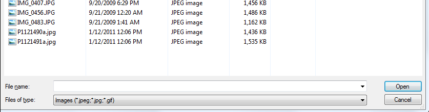

# RadAsyncUpload File Filtering

To set file filtering on modern browsers, the **accept** attribute of the **input type="file"** should be set. For example, this will allow most images:

````JavaScript
function pageLoad() {
    $telerik.$('.ruFileInput').attr('accept', 'image/*');
}
````

You can find a more detailed example in the [How to filter file selection in the upload dialog](https://www.telerik.com/support/kb/aspnet-ajax/upload-(async)/details/how-to-filter-file-selection-in-the-upload-dialog) article.

>note The `FileFilters` properties will not work in current browsers. The built-in **File filtering** functionality of RadAsyncUpload works only with browsers that run [**Flash** or **Silverlight** **Upload modules**] (). **File filtering** is **not** available for:
* Internet explorer when RadAsyncUpload is utilizing its IFrame or FileAPI module (when neither Flash, nor Silverlight are installed). 
* All modern browsers (FireFox 3.6 or grater, Google Chrome, Safari 5 and above, Edge and Internet explorer 10 and above), as in them RadAsyncUpload uses File API Upload module;

## File filtering


As of Q1 2011, **RadAsyncUpload** supports file filtering. A file filter is an object with two properties: **Description** and **Extensions**. The **Extensions** property accepts a comma separated list of extensions upon whichthe select file dialog should be filtered. The **Description** property, as its name suggests, describes the extensions set.

````ASP.NET
<telerik:RadAsyncUpload RenderMode="Lightweight" runat="server" ID="RadAsyncUpload1">
	<FileFilters>
		<telerik:FileFilter Description="Images(jpeg;jpg;gif)" Extensions="jpeg,jpg,gif" />
	</FileFilters>
</telerik:RadAsyncUpload>	
````

This setup will produce the following result:

>caption When using Silverlight as **Upload module**:

**Silverlight:** <br>  

>caption When using Flash as **Upload module**:

**Flash:** <br> 

You can apply as many filters as you want. Then, the user can choose among different filters via the Files of type combo box.

# See Also

 * [How to filter file selection in the upload dialog](https://www.telerik.com/support/kb/aspnet-ajax/upload-(async)/details/how-to-filter-file-selection-in-the-upload-dialog)

 * [RadAsyncUpload Validation Demo](http://demos.telerik.com/aspnet-ajax/upload/examples/async/validation/defaultcs.aspx?product=asyncupload)
 
 * [RadAsyncUpload Upload Modules]()
 
