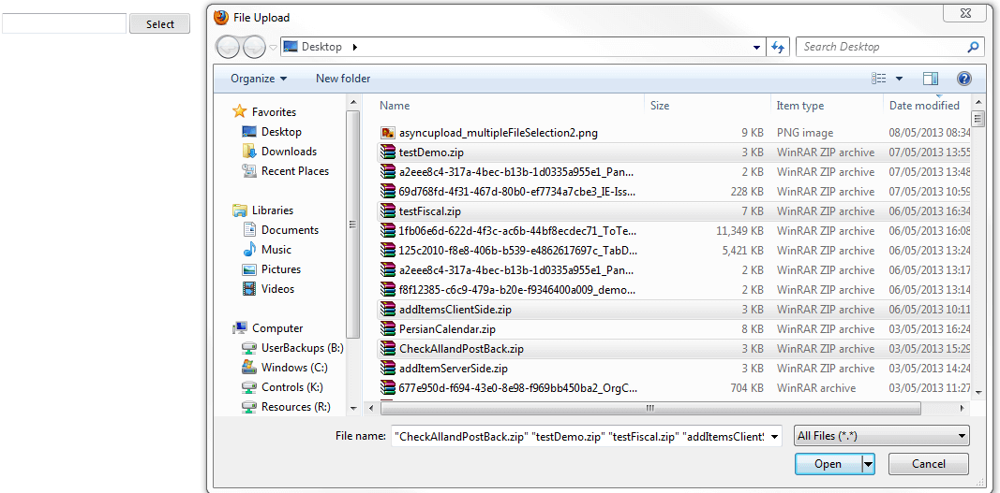

# Multiple File Selection

## Multiple File Selection

With **RadAsyncUpload** it is possible to select multiple files. You can set the **MultipleFileSelection** property to "Automatic". Multiple file selection is possible only when you are using the FileApi, Silverlight or Flash [upload module]().

When you set the **Multiple file selection**, the user can select more than one file from the File Upload dialog box by holding the Ctrl key or they can click on a file, then hold Shift down, and click on another file so all the files between them are selected(Apple computers support this using the Command key). The image below shows using the Ctrl key to choose several files.

## Succession of the client events

After the user selects files and clicks "Open", the [OnClientFilesSelected]() event is invoked and after that the [OnClientFileSelected]() event is fired for every separate file.

If the first file passes validation, [OnClientFileUploading]() is thrown and if the selected file is successfully uploaded, the [OnClientFileUploaded]() event is thrown. If the file upload fails, the [OnClientFileUploadFailed]() event is thrown instead. If the selected file does not pass the validation, [OnClientValidationFailed]() is thrown instead of **OnClientFileUploading** event. In such case any other event that follows are not reached at all for this file.

This succession is repeating for each one or the selected files and after the last one is uploaded the [OnClientFilesUploaded]() event is fired.

>note Currently setting **MultipleFileSelection=Automatic** and **MaxFileInputsCount** at the same time is not supported scenario with **RadAsyncUpload** .
>

>note In cases with **Mobile Devices** and **Tablets** if you want to have the ability to upload files from the camera by taking picture after the **Select** button is clicked the **MultipleFileSelection="Disabled"** should be set. Otherwise only the already existing files will be possible for upload.
>

## See Also

[Getting Started]()

[Manual Upload]()

[Manipulating Query String Parameters In The Upload Handler]()
