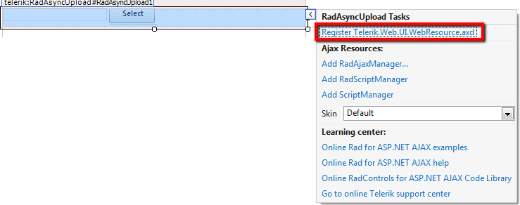
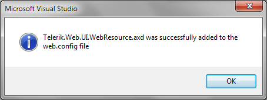

# Getting Started

This tutorial will walk you through creating a Web page that uses **RadAsyncUpload** control. It shows how to

* Use **RadAsyncUpload** to upload files.

## Getting Started

1. Create a new page and add a **RadAsyncUpload** control to it.

1. Click the Smart Tag of the **RadAsyncUpload** control to add **Telerik.Web.UI.WebResource.axd** handler in the web.config file:

1. Adding the **RadScriptManager** to the page will also automatically register the **Telerik.Web.UI.WebResource.axd** handler in the web.config file. This handler is used by both **RadScriptManager** and **RadAsyncUpload**:

1. Set the **TargetFolder** property to the folder where you want the files to be automatically uploaded after the PostBack (ex. **App_Data/UploadedFiles**).

>caution The files are *automatically* and *asynchronously* uploaded to the folder specified by the **TemporaryFolder** property but are copied to the **TargetFolder** after the postback on the page.
>
By default the **TemporaryFolder** property is set to the **App_Data/RadUploadTemp** folder. The files are uploaded with randomly generated unique names.

````ASPNET
<telerik:RadAsyncUpload RenderMode="Lightweight" ID="RadAsyncUpload1" TargetFolder="uploads" runat="server"></telerik:RadAsyncUpload>				
````

1. Finally, add a simple RadButton or an asp.net Button on the page that will postback. Press F5 from the keyboard to build and run the application. Now you need to select a file that will be uploaded. You will see the loading image indicating that the file is uploaded asynchronously. During the upload the page is interactive to the user. After clicking on the postback button - the file is saved to the **TargetFolder**.

## See Also

[Migrating from RadUpload for ASP.NET AJAX to RadAsyncUpload]()

[RadAsyncUpload vs. RadUpload for ASP.NET AJAX]()
