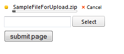
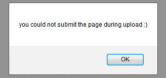

# Prevent Page Submitting While Uploading File

## Prevent page submit if file upload is in progress

Clicking on submit button if file upload is in progress



prevents the page submit and pops up a message that explains why the action is cancelled.



The following code snippets demonstrate how it can be used:

### Prevent page submit when RadAsyncUpload is in Classic RenderMode

````ASPNET
<telerik:RadAsyncUpload RenderMode="Classic" runat="server" ID="RadAsyncUpload1">
</telerik:RadAsyncUpload>
<input type="button" onclick="submitPage()" value="submit page" />
````

````JavaScript
var $ = $telerik.$;

function submitPage() {
    //finds all file uploads that are currently in progress
    var uploadingRows = $(".RadAsyncUpload").find(".ruUploadProgress");
    //iterates and checks if there are any file uploads that are successfully completed or failed and if yes - pop-up an alert box and prevent page submitting 
    for (var i = 0; i < uploadingRows.length; i++) {
        if (!$(uploadingRows[i]).hasClass("ruUploadCancelled") && !$(uploadingRows[i]).hasClass("ruUploadFailure") && !$(uploadingRows[i]).hasClass("ruUploadSuccess")) {
            alert("you could not submit the page during upload :)");
            return;
        }
    }

    theForm.submit();
}
````


### Prevent page submit when RadAsyncUpload is in Lightweight RenderMode

````ASPNET
<telerik:RadAsyncUpload RenderMode="Lightweight" runat="server" ID="RadAsyncUpload1">
</telerik:RadAsyncUpload>
<input type="button" onclick="submitPage()" value="submit page" />
````

````JavaScript
var $ = $telerik.$;

function submitPage() {
    //Checks if there are file uploads that are currently in progress
    var uploadingRows = $(".RadAsyncUpload").find(".ruUploading");
    if (uploadingRows.length > 0) {
		alert("you could not submit the page during upload :)");
        return;
	}

    theForm.submit();
}
````

