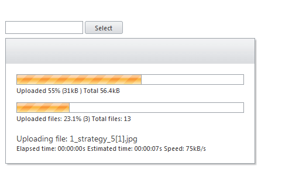

# AsyncUpload Overview


**RadAsyncUpload** introduced in Q1 2010 (version 2010.1.309) offers *asynchronous upload* capability while maintaining the look of the regular **RadUpload** control. The upload process requires that the files are uploaded to a custom handler and not to the hosting page. 

>note Files are stored in a temporary location *until a postback* occurs. Temporary files are also deleted after a set amount of time defined by the [TemporaryFileExpiration](https://docs.telerik.com/devtools/aspnet-ajax/api/server/Telerik.Web.UI/RadAsyncUpload#temporaryfileexpiration) property. (**Default value: 4 hours**)

The control *supports web farm* scenarios. Upload progress is available in this scenario as long as Flash or Silverlight is installed on the client machine.


## Get started with the RadAsyncUpload

To test it on your own and see its benefits in practice you can start a free trial using the button below

<div class="justify-content-center text-center try-button">
    <a class="button" href="https://www.telerik.com/download-trial-file/v2-b/ui-for-asp.net-ajax" target="_blank">Start a free trial</a>
</div>

<style>
.try-button {
    margin-top: 3rem;
    margin-bottom: 3rem;
}
.try-button .button {
    display: inline-block;
    font-size: 18px;
    color: #ffffff;
    background-color: #378306;
    border-radius: 2px;
    transition: color .2s ease,background-color .2s ease;
    text-decoration: none;
    padding: 10px 30px 10px 30px;
    line-height: 1.5em;
    height: auto;
}

.try-button .button:hover {
    color: #ffffff;
    background-color: #47a336;
}
</style>


>caption To create a basic `RadAsyncUpload`:

1. ensure you have a script manager on the page (use \<asp:ScriptManager> tag to declare one)
1. use the \<telerik:RadAsyncUpload> tag to declare the upload and specify the file upload folder by setting the TargetFolder property.

>caption Get started with the async upload declaration and enabling some of its features

````ASP.NET
<telerik:RadAsyncUpload RenderMode="Lightweight" ID="RadAsyncUpload1" TargetFolder="Uploads" AllowedFileExtensions=".jpeg,.jpg,.png,.doc,.docx,.xls,.xlsx" runat="server"></telerik:RadAsyncUpload>
````

For more information on setting up the environment see the [First Steps]() article.

## Temporary Files

**RadAsyncUpload** relies on saving temporary files to work. When posted, files are saved to the designated temp folder (**App_Data/RadUploadTemp** by default) with unique names. Once a postback occurs the **RadAsyncUpload** fires the **OnFileUploaded** event for each file. The target file is passed as part of the arguments to the event and can be set as either valid (default) or invalid. After the events fire, all files marked as valid are automatically saved to the **TargetFolder** if it’s set.

Finally, all processed temporary files are deleted. Temporary files are also deleted after a set amount of time defined by the **TemporaryFileExpiration** property. 

>note With the release of **Q1 2011 SP2 RadAsyncUpload** supports setting the temporary folder globally in the appSettings section of the web.config.
> **< add key="Telerik.AsyncUpload.TemporaryFolder" value="[path_to_the_temporary_folder]" />** 
>The path can be relative or absolute.
>


## Validation

Validation for **RadAsyncUpload** differs from validation in **RadUpload** as it is now possible to validate size on the client, as long as the **File API** upload module is used or there is Silverlight or Flash installed on the client's browser. If the validation fails, **RadAsyncUpload** will fire **OnClientValidationFailed**.

## Different built-in upload modules
Internally, **RadAsyncUpload** can choose between four modules for uploading - File API, IFrame, Flash and Silverlight. The module with the highest priority and most features supported is File API. The Silverlight and Flash modules are a fallback if File API is not supported and any of the two technologies are available. The final fallback is an upload using the IFrame module supported in all browsers.

## Web Farms

In web farms, each server will need to use the *same MachineKey* that **RadAsyncUpload** uses for encryption. Most web farms should already have their MachineKeys synchronized as this is the recommended approach for web farm deployment.

## What is the max file size that the AsyncUpload can handle?

One of the benefits of RadAsyncUpload is that it allows you to upload files bigger than 2GB as explained at [Uploading Large Files]().


# See Also

 * [First Steps]()
 
 * [Getting Started]()

 * [Migrating from RadUpload for ASP.NET AJAX to RadAsyncUpload]()

 * [RadAsyncUpload vs. RadUpload for ASP.NET AJAX]()

 * [RadAsyncUpload Modules]()
 
 * [Uploading Large Files]()

 * [Online Demos](https://demos.telerik.com/aspnet-ajax/asyncupload/examples/overview/defaultcs.aspx)
 

 
