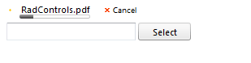

# Progress Monitoring

## RadAsyncUpload Progress Monitoring

**RadAsyncUpload** allows for two distinct ways of progress monitoring. The first one, **inline progress**, is integrated in RadAsyncUpload and displays like a progress bar below the file being uploaded. You turn on/off inline progress monitoring using the **EnableInlineProgress** property (true by default).

RadAsyncUpload displays inline progress automatically using the **File API** module — there is no need to do anything.

The second approach in using monitoring progress is using RadProgressArea. In general RadProgressArea is a dedicated control for monitoring progress, both upload and a custom one. It is possible to use both inline progress monitoring and RadProgressArea monitoring. You can learn more regarding RadProgressArea [here]().

>note To use **RadProgressArea** for progress monitoring, the **RadUploadHttpModule/Handler** should be registered in the web.config. Instructions on how to do that can be found [here]().
>

# See Also

 * [RadAsyncUpload Progress Monitoring Demo](https://demos.telerik.com/aspnet-ajax/upload/examples/async/monitorprogress/defaultcs.aspx?product=asyncupload)
