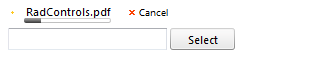

# Progress Monitoring

## RadAsyncUpload Progress Monitoring

__RadAsyncUpload__ allows for two distinct ways of progress monitoring. The first one, __inline progress__, is integrated in RadAsyncUpload and displays like a progress bar below the file being uploaded. You turn on/off inline progress monitoring using the __EnableInlineProgress__ property (true by default).

If Flash/Silvelight module is installed on the client machines, RadAsyncUpload will display inline progress automatically; there is no need to do anything. If there is neither Flash nor Silverlight available, a little tweak in the web.config is needed.More specifically, one needs to register the RadUploadHttpModule/Handler into the web.config. Instructions on how to do that can be found [here](FAFFEB65-66D2-4CFE-8F40-E4BA471540A9).

The second approach in using monitoring progress is using RadProgressArea. In general RadProgressArea is a dedicated control for monitoring progress, both upload and a custom one. It is possible to use both inline progress monitoring and RadProgressArea monitoring. You can learn more regarding RadProgressArea [here](D64A315E-6A3F-4986-80A0-A84BC2E3FE06).

>caution Please, have in mind that in order to cover all scenarios and display progress(inline or using RadProgressArea) on all client machines the RadUploadHttpModule/Handler should be registered in the web.config. Otherwise, every once in a while there will be a client computer without Flash/Silverlight installed and it is likely that no progress would be displayed for that user. The IFrame module takes care of that scenario, but it needs the module and the handler registered in the web.config
>

# See Also

 * [RadAsyncUpload Progress Monitoring Demo](http://demos.telerik.com/aspnet-ajax/upload/examples/async/monitorprogress/defaultcs.aspx?product=asyncupload)
