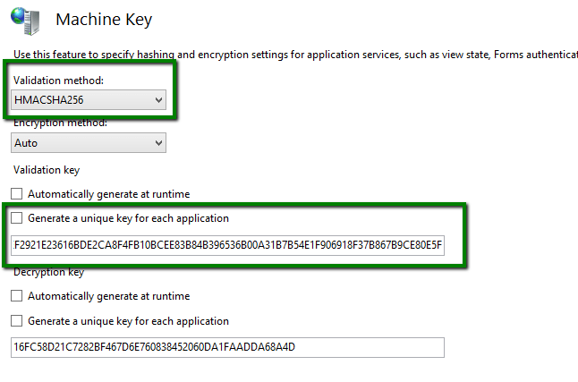

# Security

This article explains how to ensure information about the RadAsyncUpload configuration is secure and non-readable. Its transmission between the client and the server must be encrypted and impossible to decode, so the data cannot be used by a malicious entity in an attack against the server.

Configuration information includes temporary and target folder on the server, allowed file extensions and the type of the file metadata object (by default, a class from the Telerik.Web.UI.dll assembly).

>note As of **Q1 2026**, RadAsyncUpload also includes built-in **CSRF (Cross-Site Request Forgery) protection**. It validates each upload request against a session-based token generated when the control renders, preventing malicious sites from submitting unauthorized uploads on behalf of authenticated users. CSRF protection is enabled by default and requires session state - see [CSRF Protection]() for configuration details and migration notes.

This article contains the following sections:

* [Recommended Settings](#recommended-settings)
* [Configuration Keys Details](#configuration-keys-details)
	* [ConfigurationEncryptionKey](#configurationencryptionkey)
	* [ConfigurationHashKey](#configurationhashkey)
	* [AllowedCustomMetaDataTypes](#allowedcustommetadatatypes)
	* [DisableAsyncUploadHandler](#disableasyncuploadhandler)
* [FAQ](#frequently-asked-questions)


## Recommended Settings

>caution As of **2026.2.708** (R2 2026 SP1), the custom key settings have been improved, since the control now encrypts the values with AES-GCM, which provides stronger protection than the machine key fallback. It is strongly recommended to upgrade to this version or newer.

There are three `appSettings` keys you should add to your `web.config` to ensure information security with file uploads:

1. Set a custom `Telerik.AsyncUpload.ConfigurationEncryptionKey`.

2. Set a custom `Telerik.Upload.ConfigurationHashKey`.

3. Set the `Telerik.Upload.AllowedCustomMetaDataTypes` key. Check the [Metadata Type Whitelisting](#allowedcustommetadatatypes) section to avoid any breaking changes.

>tip You can use the IIS MachineKey Validation Key generator to get the encryption keys (make sure to avoid the ,IsolateApps portion):  You can see the steps of how to generate the security keys in this [YouTube video](https://www.youtube.com/watch?v=J18zDKtiBFE). Do not forget to select the *HMACSHA256* validation method that is the recommended one to generate the keys.

>caution As of R1 2020, the **Machine Key** is used automatically for the `ConfigurationEncryptionKey`, `ConfigurationHashKey` and `DialogParametersEncryptionKey` keys if they are not set explicitly. You will still need to set your own custom keys if you are using older version of the controls.

````web.config
<appSettings>
        <add key="Telerik.AsyncUpload.ConfigurationEncryptionKey" value="YOUR-FIRST-UNIQUE-STRONG-RANDOM-VALUE-UNIQUE-TO-YOUR-APP&" />
        <add key="Telerik.Upload.ConfigurationHashKey" value="YOUR-SECOND-UNIQUE-STRONG-RANDOM-VALUE-UNIQUE-TO-YOUR-APP&" />
        <add key="Telerik.Upload.AllowedCustomMetaDataTypes" value="Telerik.Web.UI.AsyncUploadConfiguration" />
</appSettings>
````

>tip You can [encrypt the appSettings section in the web.config](https://www.telerik.com/support/kb/aspnet-ajax/details/how-to-encrypt-the-telerik-appsettings-keys).

>tip In case you do not use RadAsyncUpload, you can **disable file uploads for your application** via the [Telerik.Web.DisableAsyncUploadHandler key](#disableasyncuploadhandler) web.config switch.

## Configuration Keys Details

The information below provides more details on the available keys and their usage.

>important If you do not set custom encryption and hashing keys, default (hardcoded) values are used to encrypt/decrypt the information for versions prior to R2 2017 SP1. If you are using such an old version, we recommend [upgrading]() to the latest.
>
>As of **R2 2017 SP1**, hardcoded keys are not used anymore. Instead, standard .NET methods are used for encryption. Nevertheless, you should still set your own [unique custom keys](#recommended-settings).
>
>Other cryptographic operations in the UI for ASP.NET AJAX suite may also use these two keys. Telerik avoids adding more keys in order to improve backwards compatibility of your applications and to reduce the number of properties you have to set.

Available keys:

* [ConfigurationEncryptionKey](#configurationencryptionkey)
* [ConfigurationHashKey](#configurationhashkey)
* [AllowedCustomMetaDataTypes](#allowedcustommetadatatypes)
* [DisableAsyncUploadHandler](#disableasyncuploadhandler)

### ConfigurationEncryptionKey

To provide secure encryption of the control configuration, we strongly recommend that you set a custom encryption key for `Telerik.AsyncUpload.ConfigurationEncryptionKey`:

````web.config
<appSettings>
	<add key="Telerik.AsyncUpload.ConfigurationEncryptionKey" value="YOUR-FIRST-UNIQUE-STRONG-RANDOM-VALUE-UNIQUE-TO-YOUR-APP&" />
</appSettings>
````

>tip You can [use the IIS MachineKey Validation Key generator to get the encryption keys (make sure to avoid the ,IsolateApps portion)](../images/generate-keys-iis.png).


### ConfigurationHashKey

The additional `Telerik.Upload.ConfigurationHashKey` key is used to hash the encrypted text. The value returned from the client is checked in the upload handler for integrity.

````web.config
<appSettings>
	<add key="Telerik.Upload.ConfigurationHashKey" value="YOUR-SECOND-UNIQUE-STRONG-RANDOM-VALUE-UNIQUE-TO-YOUR-APP&" />
</appSettings>
````

>tip You can [use the IIS MachineKey Validation Key generator to get the encryption keys (make sure to avoid the ,IsolateApps portion)](../images/generate-keys-iis.png).

### AllowedCustomMetaDataTypes

As of **R3 2019 SP1**, the metadata classes (upload configurations) can be whitelisted. That allows the application to use only the metadata classes from a whitelisted collection of configurations.

>important If you add any types, you must add all types that you use, otherwise those that are not whitelisted will throw a *[The cryptographic operation has failed!](https://docs.telerik.com/devtools/aspnet-ajax/knowledge-base/asyncupload-the-cryptographic-operation-has-failed-error-after-upgrade)* error when uploading.

There are several situations when you may be using a custom metadata class, you can read more on the most common cases in the following resources. This can help you determine whether you have such code in your application for any purpose. If you do, read the information after this list to see how to apply whitelisting for them.

* [Sending custom information to and from a custom handler](#send-custom-information-to-and-from-the-handler)
* [Capturing file upload errors from a custom handler](https://www.telerik.com/support/kb/aspnet-ajax/upload-(async)/details/how-to-capture-file-upload-errors-with-custom-handler)
* [Preserving upload configuration across postbacks]()

To whitelist your custom types, add the `Telerik.Upload.AllowedCustomMetaDataTypes` key in the `appSettings` section of the `web.config`. As a value for the key, provide the metadata class full name, including the namespace, in a list delimited by a semicolon (`;`). The built-in type that we use out-of-the-box is always whitelisted. For an easy way to obtain the fully qualified name of the configuration class you need to add, check the example in the following KB article:

* [The cryptographic operation has failed!](https://docs.telerik.com/devtools/aspnet-ajax/knowledge-base/asyncupload-the-cryptographic-operation-has-failed-error-after-upgrade)

>caption Whitelist custom metadata types

````web.config
<appSettings>
    <add key="Telerik.Upload.AllowedCustomMetaDataTypes" value="SomeNameSpace.SampleAsyncUploadConfiguration;SomeOtherNameSpace.OtherAsyncUploadConfiguration" />
</appSettings>
````


>note This is an additional security measure and it does not replace setting the [main custom encryption keys](#recommended-settings).

Failure to deserialize a custom metadata type will also throw a `CryptographicException` on the server and the handler request will fail, resulting in a `The cryptographic operation has failed!` error on the client.

[Custom handlers]() **are** affected by this feature.


### DisableAsyncUploadHandler

You can disable file uploads through RadAsyncUpload's built-in configuration altogether. This feature is available as of **R2 2017 SP2 (2017.2.711)**.

Setting the `Telerik.Web.DisableAsyncUploadHandler` key to `true` disables the built-in RadAsyncUpload handler that is used for storing files in the temporary folder before they are moved to the target folder.

When you set this key to `true`, no files can be uploaded to the default handler (`Telerik.Web.UI.WebResource.axd`) and async upload requests to it will return a 404 error. You may want to handle the [OnClientFileUploadFailed event]() to prevent the page from throwing JavaScript errors.

[Custom handlers]() are **not** affected by this feature and you can still use them to upload and save files with the desired level of security.

>caption How to disable (make unavailable) the default Async Upload handler so no files can be uploaded through it.

````web.config
<appSettings>
	<add key="Telerik.Web.DisableAsyncUploadHandler" value="true"/>
</appSettings>
````

## Frequently Asked Questions

* *How to generate the security keys?* - See the [Generate security keys for RadAsyncUpload (Telerik UI for ASP.NET AJAX) video](https://www.youtube.com/watch?v=J18zDKtiBFE).
* *How to find what version of the Telerik the website used?* - see this article [How to find out which is the used version of Telerik.Web.UI in the web application](https://www.telerik.com/products/aspnet-ajax/documentation/knowledge-base/common-assembly-version).
* *Am I supposed to decrypt the RadAsyncUpload settings?* - The ecryption/decryption of the AsyncUpload settings is performed built-in by the control and you are not supposed to do anything more than setting the [ConfigurationEncryptionKey](#ConfigurationEncryptionKey) and [ConfigurationHashKey](#ConfigurationHashKey) settings and their secure keys in the web.config.
* *How to secure the uploaded files?* - The AsyncUpload does not manipulate the files itself. The files need to be secured manually either on a postback as explained in [How to manipulate the uploaded files]() and/or by implementing a [Custom RadAsyncUpload Handler]().
* *How large (in bits or bytes) these encryption keys must be?* - We recommend a very strong encryption mechanism such as HMACSHA256.
* *Is there a scanner to detect CVE-2019-18935 in my system* - While Progress Telerik does not offer and support a vulnerability detection scanner, there is a [third-party scanner](https://github.com/ThanHuuTuan/Telerik_CVE-2019-18935) that you can try at your own risk.
* *Should I keep using the machine key fallback, or set custom keys?* - As of **2026.2.708**, we recommend setting your own custom `Telerik.AsyncUpload.ConfigurationEncryptionKey`, `Telerik.Upload.ConfigurationHashKey`, and `Telerik.Web.UI.DialogParametersEncryptionKey` values, since they are now protected with AES-GCM, which is stronger than the machine key fallback. If you rely on the machine key instead (for example, in a web farm), make sure it is explicitly generated in IIS with the *HMACSHA256* validation method and that automatic key generation is disabled. See [CVE-2026-13182]() for more information.
* *Is RadUpload vulnerable to any known security issues?* - While [RadUpload]() does not have known vulnerabilities, it has been discontinued in June 2013 (Q2’13) in favor of RadAsyncUpload and because of that, we do not recommend using it.
* *Where do we find a complete list of the known vulnerabilities?* - The KB articles below discuss all the known vulnerabilities in the Telerik AJAX controls:
    * [RadAsyncUpload AsyncUploadTypeName Type Resolution Vulnerability (CVE-2026-13181)](https://www.telerik.com/products/aspnet-ajax/documentation/knowledge-base/kb-security-rau-asyncuploadtypename-deserialization-cve-2026-13181)
    * [RadAsyncUpload Client-State Decrypt-vs-Parse Oracle Vulnerability (CVE-2026-13182)](https://www.telerik.com/products/aspnet-ajax/documentation/knowledge-base/kb-security-rau-padding-oracle-cve-2026-13182)
    * [RadAsyncUpload Upload Metadata Timing Oracle Vulnerability (CVE-2026-13183)](https://www.telerik.com/products/aspnet-ajax/documentation/knowledge-base/kb-security-rau-timing-oracle-cve-2026-13183)
    * [RadAsyncUpload Default HMAC Key Fallback Vulnerability (CVE-2026-13184)](https://www.telerik.com/products/aspnet-ajax/documentation/knowledge-base/kb-security-rau-unauth-deserialization-chain-cve-2026-13184)
	* [Allows JavaScriptSerializer Deserialization (CVE-2019-18935)](https://www.telerik.com/support/kb/aspnet-ajax/details/allows-javascriptserializer-deserialization)
	* [Blue Mockingbird Vulnerability Picks up Steam—Telerik Guidance blog post (CVE-2019-18935)](https://www.telerik.com/blogs/blue-mockingbird-vulnerability-telerik-guidance)
	* [Unrestricted File Upload (CVE-2014-2217 and CVE-2017-11317)](https://www.telerik.com/support/kb/aspnet-ajax/upload-(async)/details/unrestricted-file-upload)
	* [Cryptographic Weakness (CVE-2017-9248)](https://www.telerik.com/support/kb/aspnet-ajax/details/cryptographic-weakness)
	* [Insecure Direct Object Reference (CVE-2017-11357)](https://www.telerik.com/support/kb/aspnet-ajax/upload-(async)/details/insecure-direct-object-reference)
	* Other places to check for Telerik related vulnerabilities are the CVE databases such as [https://www.cvedetails.com/vulnerability-list/vendor_id-14130/Telerik.html](https://www.cvedetails.com/vulnerability-list/vendor_id-14130/Telerik.html) and [https://nvd.nist.gov/vuln/data-feeds](https://nvd.nist.gov/vuln/data-feeds) as advised by the [First 5 Tips for Building Secure (Web) Apps](https://www.telerik.com/blogs/first-5-tips-for-building-secure-web-apps) blog post.
* *Are there any other Security articles to check* - Yes, please review the following resources:
	* [Mandatory Additions to the web.config]()
	* [RadEditor Security](https://docs.telerik.com/devtools/aspnet-ajax/controls/editor/functionality/dialogs/security)
	* [RadFileExplorer Security](https://docs.telerik.com/devtools/aspnet-ajax/controls/fileexplorer/security).


## See Also

* [Security Overview](https://www.telerik.com/products/aspnet-ajax/documentation/security/security-information)
* [web.config Settings Overview]()
* [Create a Custom Handler for RadAsyncUpload]()
* [The cryptographic operation has failed! error](https://docs.telerik.com/devtools/aspnet-ajax/knowledge-base/asyncupload-the-cryptographic-operation-has-failed-error-after-upgrade)
* [Blue Mockingbird Vulnerability Picks up Steam—Telerik Guidance blog post](https://www.telerik.com/blogs/blue-mockingbird-vulnerability-telerik-guidance)
* [Allows JavaScriptSerializer Deserialization (CVE-2019-18935)](https://www.telerik.com/support/kb/aspnet-ajax/details/allows-javascriptserializer-deserialization)
* [RadAsyncUpload Client-State Decrypt-vs-Parse Oracle Vulnerability (CVE-2026-13182)]()
* [Progress’ Security Practices for Vulnerability Communications and Remediation](https://www.telerik.com/blogs/progress-security-practices-vulnerability-communications-remediation)
* [Unrestricted File Upload (CVE-2014-2217 and CVE-2017-11317)](https://www.telerik.com/support/kb/aspnet-ajax/upload-(async)/details/unrestricted-file-upload)
* [Cryptographic Weakness (CVE-2017-9248)](https://www.telerik.com/support/kb/aspnet-ajax/details/cryptographic-weakness)
* [Insecure Direct Object Reference (CVE-2017-11357)](https://www.telerik.com/support/kb/aspnet-ajax/upload-(async)/details/insecure-direct-object-reference)
* [RadEditor Security](https://docs.telerik.com/devtools/aspnet-ajax/controls/editor/functionality/dialogs/security)
* [RadFileExplorer Security](https://docs.telerik.com/devtools/aspnet-ajax/controls/fileexplorer/security)
* [First 5 Tips for Building Secure (Web) Apps blog post](https://www.telerik.com/blogs/first-5-tips-for-building-secure-web-apps)
