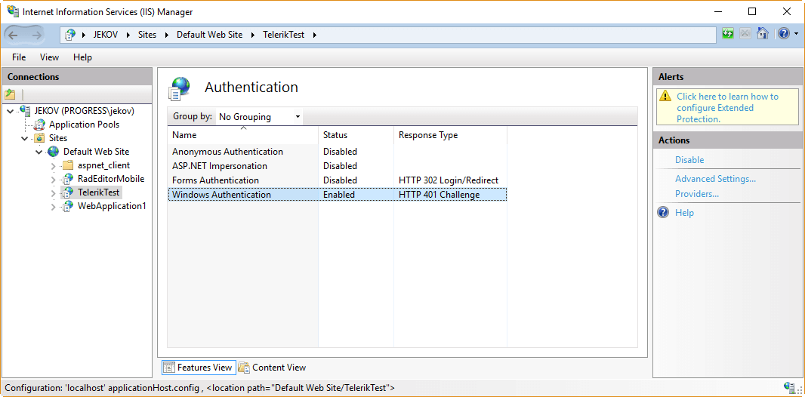

# Inability to upload files on iOS and OSX devices with enabled Windows Authentication
When uploading a file using **RadAsyncUpload** in Safari on iOS and OSX, the upload could hang and never completes.
 
The problem is due to a bug in Safari and happens only with enabled **Windows authentication and disabled Anonymous Authentication**:
 

It is reproducible with a standard `<input type="file" name="file" enctype="multipart/form-data" />` HTML element in ASP.NET Web applications.

## Affected components
Since the upload functionality of RadFileExplorer and RadEditor File Browser dialogs are based on RadAsyncUpload, the problem can be observed there too.
 
## The Solution
A complete solution could be provided only by Apple by providing better support for Windows Authentication in Safari. 

You can try to workaround it with the suggestions provided in this StackOverflow thread: [Programmatically enable or disable anonymous authentication in IIS](http://stackoverflow.com/questions/28419304/programmatically-enable-or-disable-anonymous-authentication-in-iis), i.e. build a separate web service for file upload with authentication setting as Anonymous for Safari scenarios, and the main app authentication setting as Windows Authentication.
