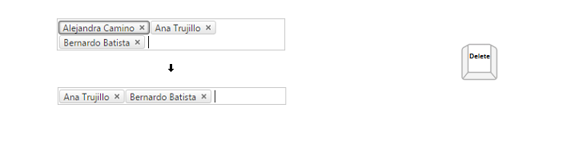

# Keyboard Support

## 

**RadAutoCompleteBox** provides support for the two relevant aspects of keyboard support:

1. **Access Keys** - You can specify a key that lets the user move focus directly to the AutoCompleteBox. Once focus is on the AutoCompleteBox, the user can use the arrow keys for navigation. The access key is defined using the **AccessKey** property. For example, if you set the **AccessKey** property to "W", focus moves to the combobox when the user types "Alt+W".

2. **Key Navigation** - RadAutoCompleteBox allows users to navigate the AutoCompleteBox structure (both the input area and the dropdown) using the arrow keys:

* The "Alt + AccessKey" focuses the AutoCompleteBox 

>tip To focus the **RadAutoCompleteBox** in Firefox use the "Shift + Alt + AccessKey" key combination.
>

* The Up and Down arrow keys allows the user to navigate the entries in the dropdown, once it is opened by typing text in the input area 

* The Left and Right arrow keys allows the user to navigate the entries in the input area 

* The "Enter" key selects the highlighted entry in the dropdown 

* The "Delete" or "Backspace" keys delete a highlighted entry in the input area 

* The "F2" key puts the token in edit mode if it is enabled 

* The "Esc" key puts closes the dropdwon and if pressed again deletes the text in the input area 
