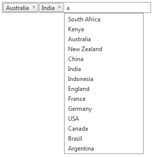

# DropDown Position

## DropDownPosition property

>note Note that the property is valid after 2012 Q3 SP1 and above.
>

You could easily adjust the position of the DropDown of the __RadAutoCompleteBox__, by simply managing the __DropDownPosition__ property. There are two values that can be set with the DropDownPosition property - __Automatic__ and __Static__. If the Automatic value is set, the DropDown would appear right beneath the token, which is about to be added. If the RadAutoCompleteBox is configured using the Static DropDownPosition, the DropDown would appear beneath the left end of the control. The behavior of the DropDownPosition property will be applied, regardless the InputType of the RadAutoCompleteBox.

|  __DropDownPosition="Automatic"__ . |  __DropDownPosition="Static"__ . |
| ------ | ------ |
|||
