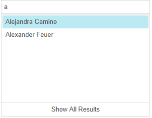

# Filtering


## Filtering

__RadAutoCompleteBox__ control provides implicit server-side filtering functionality, loading the drop-down items on demand.Once the user starts typing in the input area of the control, a request for new items is made to the server. The items are fetched from the server based on the value set to the__Filter__ property.

There are two __filtering__ options available:

* __Contains__ - Filters all items which Text value contains the searched text as a substring.

* __StartsWith__ - Filters all items which Text value starts with the searched text.

>important The default value of Filter property is __Contains__ .
>

>caption 


As of __Q3 2013__ release, we had introduced two properties - __MaxFilterLength__ and __MaxResultCount__:

* __MaxFilterLength__ - Sets the minimum length of the typed text before the control initiates a request for its DataSource.

* __MaxResultCount__ - Sets how many results will the __RadAutoCompleteBox__ be populated with.When this property is set, a "Show All Results" button appears at the bottom of the dropdown. Clicking this button will load all corresponding results.

When a __WebService__ binding scenario is implemented and you need to use the __"Show All Results"__ button and manage its visibility, the following requirements needs to be met:

* __MaxResultCount__ should be set to a desirable value.

* A custom calculation in the __WebService__ needs to be implemented, so you could check if the __"Show All Results"__ button needs to be visible. For example, if the entries count returned from the data source match the __MaxResultCount__ value - the __"Show All "Results"__ should not be visible. In this case you could toggle its Visible state by simply setting __EndOfItems__ property of the __AutoCompleteBoxData__ object in the following manner:

>tabbedCode

````C#
	
	       AutoCompleteBoxData data = new AutoCompleteBoxData();
	       data.EndOfItems = true;
	
````
````VB.NET
	    Dim data As New AutoCompleteBoxData()
	    data.EndOfItems = True
	#End Region
	End Class


>end

>note In cases when __MaxResultCount__ property is used in RadAutoCompleteBox and the __DataSourceSelect__ event is handled manually in order for __Show All Results__ button to appear correctly, we recommend that the amount of items that will be selected should be at least with one item greater than __MaxResultCount__ .
>


Both properties could be very useful in a heavy-data scenario. Controlling the __MaxFilterLength__, could give you the ability to perform a search in your database, regarding the sequence of the typed characters. If the result is still potentially large, you could use the__MaxResultCount__, in order to return the first 100 results for example.
