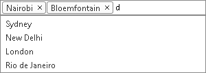
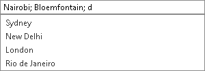

# Input Types


## Entries Input Types

RadAutoCompleteBox provides two different visual representations of its entries. The preferable visualization is set via the **InputType** property of **RadAutoCompleteBox** which takes one of the following two values:

* **Token** - visualizes the entries as tokens.

* **Text** - visualizes the entries as a series of strings separated by delimiter.

>tip By default the text of the entries is represented as tokens.
>


|  **InputType="Token"** . |  **InputType="Text"** . |
| ------ | ------ |
|||

Despite of the chosen input type, the entries of RadAutoCompleteBox will be accessible server-side through the **Entries** collection.

````ASPNET
<telerik:RadAutoCompleteBox RenderMode="Lightweight" ID="RadAutoCompleteBox1" runat="server" DataSourceID="SqlDataSource1"
	DataValueField="ID" DataTextField="Name" InputType="Token">
</telerik:RadAutoCompleteBox>
<br /><br />
<telerik:RadButton RenderMode="Lightweight" runat="server" ID="RadButton2" OnClick="RadButton1_Click" Text="Get Selected Entries" />
<div>
	<strong>Selected Entries: </strong>
	<br /> 
	<asp:Label ID="Label1" runat="server" BorderStyle="None" CssClass="text" />
</div>
<asp:SqlDataSource ID="SqlDataSource1" runat="server" ConnectionString="<%$ ConnectionStrings:TelerikConnectionString %>"
	SelectCommand="SELECT [ID], [NAME] FROM [Cities]"></asp:SqlDataSource>
````


````C#
	
protected void RadButton1_Click(object sender, EventArgs e)
{
	StringBuilder entriesText = new StringBuilder();
	AutoCompleteBoxEntryCollection collection = RadAutoCompleteBox1.Entries;

	foreach (AutoCompleteBoxEntry entry in collection)
		entriesText.Append(entry.Text + "<br />");

	Label1.Text = entriesText.ToString();
}
	
````
````VB.NET
	
Protected Sub RadButton1_Click(sender As Object, e As EventArgs)
	Dim entriesText As New StringBuilder()
	Dim collection As AutoCompleteBoxEntryCollection = RadAutoCompleteBox1.Entries

	For Each entry As AutoCompleteBoxEntry In collection
		entriesText.Append(entry.Text + "<br />")
	Next

	Label1.Text = entriesText.ToString()
End Sub
	
````

