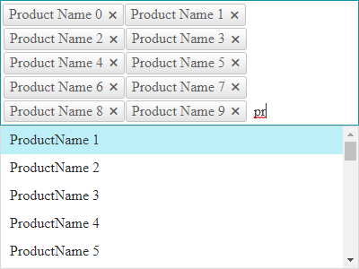
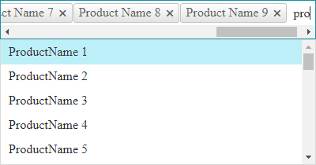

# Single Line Entries

The Single Line Entries feature allows displaying the entries inline or wrapped in multiple lines. This functionality is available as of **R1 2023 SP1** and can be controlled by setting the **SingleLineEntries** property to **Disabled** (*Figure 1*) or **Enabled** (*Figure 2*). 


**Figure 1**: `SingleLineEntries="Disabled"` (*default*)




**Figure 2**: `SingleLineEntries="Enabled"`




## Controlling the SingleLineEntries

This property can be set either in the Markup or in the CodeBehind

>caption Markup Example

````ASP.NET
<telerik:RadAutoCompleteBox RenderMode="Lightweight" ID="RadAutoCompleteBox1" runat="server" SingleLineEntries="Enabled">
</telerik:RadAutoCompleteBox>
````

>caption CodeBehind Example

````C#
protected void Page_Load(object sender, EventArgs e)
{
    if (!IsPostBack)
    {
        RadAutoCompleteBox1.SingleLineEntries = RadAutoCompleteSingleLineEntries.Enabled;
    }
}
````
````VB
Protected Sub Page_Load(ByVal sender As Object, ByVal e As EventArgs)
    If Not IsPostBack Then
        RadAutoCompleteBox1.SingleLineEntries = RadAutoCompleteSingleLineEntries.Enabled
    End If
End Sub
````

