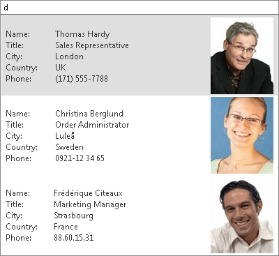
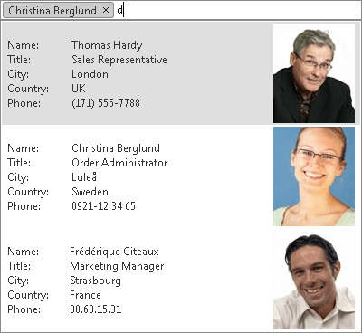

# Server Templates


## 

RadAutoCompleteBox supports server templates of its drop-down items. If no **DropDownItemTemplate** is specified, the items are rendered using their **Text** property as plain text. If you specify an **DropDownItemTemplate**, however, the respective template is used for rendering.

The following application scenario shows an example of RadAutoCompleteBox using DropDownItemTemplate.

A <DropDownItemTemplate> section is added to the **RadAutoCompleteBox** declaration. The image and the text that appear in the template are taken from the DataItem using <%# DataBinder.Eval %> statements.

````C#
			<telerik:RadAutoCompleteBox runat="server" ID="RadAutoCompleteBox1" InputType="Token"
				DataSourceID="SqlDataSource1" Width="400px" DataTextField="ContactName" DropDownWidth="400px">
				<DropDownItemTemplate>
					<table cellpadding="0" cellspacing="0">
						<tr>
							<td>
								<table cellpadding="0" cellspacing="0">
									<tr>
										<td style="width: 25%">
											Name:
										</td>
										<td style="width: 50%">
											<%# DataBinder.Eval(Container.DataItem, "ContactName")%>
										</td>
									</tr>
									<tr>
										<td>
											Title:
										</td>
										<td>
											<%# DataBinder.Eval(Container.DataItem, "ContactTitle")%>
										</td>
									</tr>
									<tr>
										<td>
											City:
										</td>
										<td>
											<%# DataBinder.Eval(Container.DataItem, "City")%>
										</td>
									</tr>
									<tr>
										<td>
											Country:
										</td>
										<td>
											<%# DataBinder.Eval(Container.DataItem, "Country")%>
										</td>
									</tr>
									<tr>
										<td>
											Phone:
										</td>
										<td>
											<%# DataBinder.Eval(Container.DataItem, "Phone")%>
										</td>
									</tr>
								</table>
							</td>
							<td align="right" style="width: 25%; padding-left: 10px;">
								<telerik:RadBinaryImage ID="RadBinaryImage1" runat="server" AlternateText="Contact Photo"
									ToolTip="Contact Photo" Width="90px" Height="110px" ResizeMode="Fit" DataValue='<%# DataBinder.Eval(Container.DataItem, "Photo")%>' />
							</td>
						</tr>
					</table>
				</DropDownItemTemplate>
			</telerik:RadAutoCompleteBox>
	
			<asp:SqlDataSource ID="SqlDataSource1" runat="server" ConnectionString="<%$ ConnectionStrings:TelerikConnectionString %>"
				ProviderName="System.Data.SqlClient" SelectCommand="SELECT TOP 6 * FROM [CustomerPhotos]" />
````


|  **RadAutoCompleteBox** before a selection is made. |  **RadAutoCompleteBox** after a selection is made. |
| ------ | ------ |
|||

# See Also

 * [Overview]()
