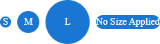
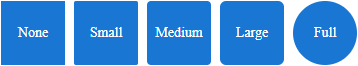
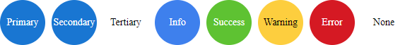
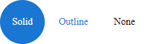
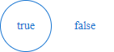

# Appearance

The Avatar exposes a few properties that will allow you to change its appearance.

- [Appearance demo](https://demos.telerik.com/aspnet-ajax/avatar/appearance/defaultcs.aspx)


## Type

The available `Type` values are:

- `Text` (Default) - Displays the text set in the **Text** property
- `Image` - Displays an image set in the **Image** property
  - Requires the Web URL of the image
- `Icon` - Displays an icon (font-icon) set in the **Icon** property. 
  - Requires the icon's name. 
  - The list of available icons can be found in the [Web Font Icons](https://docs.telerik.com/kendo-ui/styles-and-layout/sass-themes/font-icons) article. 
  - To understand the name, exclude the `.k-i-` prefix. For example, if the icon is called `.k-i-layout-stacked` then the name would be `layout-stacked`.


Example

````ASP.NET
<telerik:RadAvatar runat="server" Type="Text" Text="JS" />
<telerik:RadAvatar runat="server" Type="Image" Image="https://demos.telerik.com/aspnet-ajax/Img/Northwind/Customers/Thumbs/MEREP.jpg" />
<telerik:RadAvatar runat="server" Type="Icon" Icon="user" />
````

## Size

The available `Size` values are:

- `Small`
- `Medium` (Default)
- `Large`
- `None` - The Avatar will expand based on its content (Text, Icon size, Image Size)



Example

````ASP.NET
<telerik:RadAvatar runat="server" Type="Text" Size="Small" Text="S" />
<telerik:RadAvatar runat="server" Type="Text" Size="Medium" Text="M" />
<telerik:RadAvatar runat="server" Type="Text" Size="Large" Text="L" />
<telerik:RadAvatar runat="server" Type="Text" Size="None" Text="No Size Applied" />
````

## Rounded

The available `Rounded` values are:

- `None` - Renders an avatar with no border radius (square avatar).
- `Small` - Renders an avatar with small border radius.
- `Medium` - Renders an avatar with medium border radius.
- `Large` - Renders an avatar with large border radius.
- `Full` (default) - Renders a circle shape avatar.



Example

````ASP.NET
<telerik:RadAvatar runat="server" Type="Text" Size="Large" Text="None" Rounded="None" />
<telerik:RadAvatar runat="server" Type="Text" Size="Large" Text="Small" Rounded="Small" />
<telerik:RadAvatar runat="server" Type="Text" Size="Large" Text="Medium" Rounded="Medium" />
<telerik:RadAvatar runat="server" Type="Text" Size="Large" Text="Large" Rounded="Large" />
<telerik:RadAvatar runat="server" Type="Text" Size="Large" Text="Full" Rounded="Full" />
````


## Theme Color

The available `ThemeColor` values are:

- `Primary` (Default)- Applies coloring based on the primary theme color.
- `Secondary` - Applies coloring based on the secondary theme color.
- `Tertiary` - Applies coloring based on the tertiary theme color.
- `Info` - Applies coloring based on the info theme color.
- `Success` - Applies coloring based on the success theme color.
- `Warning` - Applies coloring based on the warning theme color.
- `Error` - Applies coloring based on the error theme color.
- `None` - will apply no theme color class.



Example

````ASP.NET
<telerik:RadAvatar runat="server" Type="Text" Size="Large" ThemeColor="Primary" Text="Primary" />
<telerik:RadAvatar runat="server" Type="Text" Size="Large" ThemeColor="Secondary" Text="Secondary" />
<telerik:RadAvatar runat="server" Type="Text" Size="Large" ThemeColor="Tertiary" Text="Tertiary" />
<telerik:RadAvatar runat="server" Type="Text" Size="Large" ThemeColor="Info" Text="Info" />
<telerik:RadAvatar runat="server" Type="Text" Size="Large" ThemeColor="Success" Text="Success" />
<telerik:RadAvatar runat="server" Type="Text" Size="Large" ThemeColor="Warning" Text="Warning" />
<telerik:RadAvatar runat="server" Type="Text" Size="Large" ThemeColor="Error" Text="Error" />
<telerik:RadAvatar runat="server" Type="Text" Size="Large" ThemeColor="None" Text="None" />
````


## Fill Mode

The `FillMode` values are:

- `Solid` (Default)
- `Outline`
- `None`



Example

````ASP.NET
<telerik:RadAvatar runat="server" Type="Text" Size="Large" FillMode="Solid" Text="Solid" />
<telerik:RadAvatar runat="server" Type="Text" Size="Large" FillMode="Outline" Text="Outline" />
<telerik:RadAvatar runat="server" Type="Text" Size="Large" FillMode="None" Text="None" />
````

## Border

The `Border` values are:

- `true` 
- `false` (Default)



Example

````ASP.NET
<telerik:RadAvatar runat="server" Type="Text" FillMode="Outline" Size="Large" Border="true" Text="true" />
<telerik:RadAvatar runat="server" Type="Text" FillMode="Outline" Size="Large" Border="false" Text="false" />
````
 
