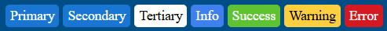

# Appearance

The Badge provides predefined appearance options such as different sizes, border radiuses, fill modes and theme colors.

For a live example, visit the [Appearance Demo of the Badge](https://demos.telerik.com/aspnet-ajax/badge/appearance/defaultcs.aspx).

## Options

The Telerik WebForms Badge supports the following styling options:

- [`Size`](#size) - Configures the overall size of the component.
- [`ThemeColor`](#themecolor) - Configures what color will be applied to the component.
- [`FillMode`](#fillmode) - Configures how the color is applied to the component.
- [`Rounded`](#rounded) - Configures the border radius of the component.
- [`Position`](#position) - Configures the position of the component.
- [`Align`](#align) - Configures the alignment  of the component.
- [`CutoutBorder`](#cutout-border) - Configures the cutout border of the component.
- [`Icon`](#icon) - Displays an icon.

## Size

The size option controls how big or small the rendered badge looks.


The following values are available for the `size` option:

- `Small`
- `Medium` (default)
- `Large`

Example

````ASP.NET
<telerik:RadBadge runat="server" Text="Small" Size="Small" />
<telerik:RadBadge runat="server" Text="Medium" Size="Medium" />
<telerik:RadBadge runat="server" Text="Large" Size="Large" />
````

## FillMode

The `FillMode` option controls the way the color is applied to the rendered div.


The following values are available for the `FillMode` option:

- `Solid` (default)
- `Outline`

Example

````ASP.NET
<telerik:RadBadge runat="server" Text="Solid" FillMode="Solid" />
<telerik:RadBadge runat="server" Text="Outline" FillMode="Outline" />
````

## ThemeColor

The `ThemeColor` option controls the color that will be applied to the rendered Badge.



The following values are available for the `ThemeColor` option:

- `Primary`
- `Secondary` (default)
- `Tertiary`
- `Info`
- `Success`
- `Warning`
- `Error`

Example

````ASP.NET
<telerik:RadBadge runat="server" ID="RadBadge1" Text="Primary" ThemeColor="Primary" />
<telerik:RadBadge runat="server" ID="RadBadge2" Text="Secondary" ThemeColor="Secondary" />
<telerik:RadBadge runat="server" ID="RadBadge3" Text="Tertiary" ThemeColor="Tertiary" />
<telerik:RadBadge runat="server" ID="RadBadge4" Text="Info" ThemeColor="Info" />
<telerik:RadBadge runat="server" ID="RadBadge5" Text="Success" ThemeColor="Success" />
<telerik:RadBadge runat="server" ID="RadBadge6" Text="Warning" ThemeColor="Warning" />
<telerik:RadBadge runat="server" ID="RadBadge7" Text="Error" ThemeColor="Error" />
````

## Rounded

The `Rounded` option controls how much border radius is applied to the rendered Badge.


The following values are available for the `Rounded` option:

- `Small`
- `Medium` (default)
- `Large`
- `Full`

Example

````ASP.NET
<telerik:RadBadge runat="server" ID="RadBadge1" Text="Small" Rounded="Small" />
<telerik:RadBadge runat="server" ID="RadBadge2" Text="Medium" Rounded="Medium" />
<telerik:RadBadge runat="server" ID="RadBadge3" Text="Large" Rounded="Large" />
<telerik:RadBadge runat="server" ID="RadBadge4" Text="Full" Rounded="Full" />
````

# Position 

The `Position` option specifies position of the Badge relative to the edge of the container


The following values are available for the `Position` option:

- `Inline`
- `Edge` (default)
- `Inside`
- `Outside`

# Align 

The `Align` option specifies position of the Badge relative to its container

Note: when using `Align`, make sure the Badge container has [CSS position](https://developer.mozilla.org/en-US/docs/Web/CSS/position) other than `static` and allows [overflow content](https://developer.mozilla.org/en-US/docs/Web/CSS/overflow).

The following values are available for the `Align` option:

- `TopStart`
- `TopEnd` (default)
- `BottomStart`
- `BottomEnd`

````ASP.NET
<button>
    TopStart
    <telerik:RadBadge runat="server" Position="Edge" Align="TopStart" />
</button>

<button>
    TopEnd
    <telerik:RadBadge runat="server" Position="Edge" Align="TopEnd" />
</button>

<button>
    BottomStart
    <telerik:RadBadge runat="server" Position="Edge" Align="BottomStart" />
</button>

<button>
    BottomEnd
    <telerik:RadBadge runat="server" Position="Edge" ID="RadBadge8" Align="BottomEnd" />
</button>
````

## Cutout Border

The `CutoutBorder` option specifies whether or not to render additional "cutout" border around the badge.


````ASP.NET
<telerik:RadBadge runat="server" CutoutBorder="false" />
<telerik:RadBadge runat="server" CutoutBorder="true" />
````

The display of the `CutoutBorder` option is controlled by specifying either `true` or `false`. 

## Icon

To enable icons for the badge, set the `Icon` property to the **name** of the embedded icon. 

Visit the [Progress Design System - List of Icons](https://docs.telerik.com/kendo-ui/styles-and-layout/sass-themes/font-icons#list-of-font-icons) page and find the icon of your choice.


Example

````ASP.NET
<telerik:RadBadge runat="server" ID="RadBadge1" Icon="x" />
<telerik:RadBadge runat="server" ID="RadBadge2" Icon="undo" />
<telerik:RadBadge runat="server" ID="RadBadge3" Icon="redo" />
<telerik:RadBadge runat="server" ID="RadBadge4" Icon="clock" />
````

## Next Steps

- [Client-side Programming]()
- [Server-side Programming]()
