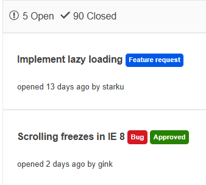

# Badge Overview

The Badge is an absolutely positioned element that is used to decorate avatars, navigation menus, or other components in the application when the visual notification is needed.
It also provides customizing its content through templates, setting different shapes and layouts.

This component is a server-side, ASP.NET WebForms wrapper over the [Kendo UI Badge widget](https://docs.telerik.com/kendo-ui/controls/badge/overview).





The Badge component is versatile and can be used in various real-life scenarios across web and mobile applications. Here are some examples:

**Showing number of notifciations**, Badge UI components can be used to show the amount of notificaitons the user has.

**Labels on Dashboards**, Badges effectively show the different types of items of a Dashboard.

To see the Badge in action, you can check out the live examples at [WebForms Badge demos](https://demos.telerik.com/aspnet-ajax/badge/overview/defaultcs.aspx).

## Functionality and Features

- [Appearance]() - The Badge delivers ready-to-use, predefined sets of styling options.

## Next Steps

- [Getting Started with the Telerik WebForms Badge]()
- [Change the Appearance]()
- [Client-side Programming]()
- [Server-side Programming]()
