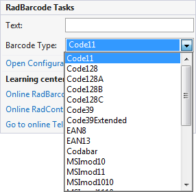
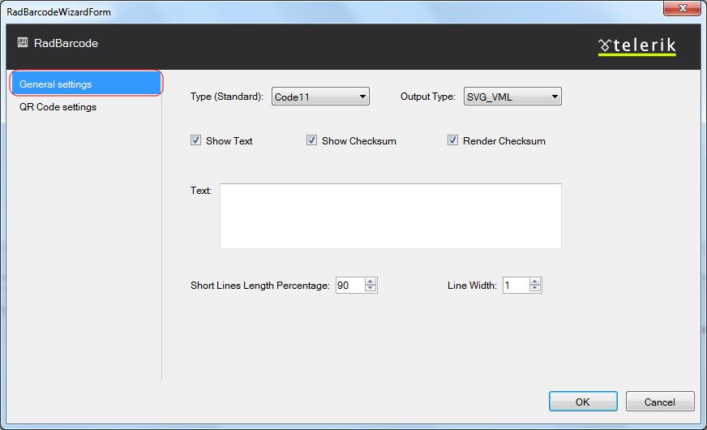
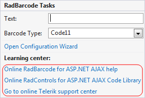

# Design Time

The __RadBarcode__ Smart Tag provides convenient access to the most common settings of the control.You can display the Smart Tag by right clicking on the __RadBarcode__ in the design window, and choosing the"Show Smart Tag" option from its context menu.

The options which are exposed through the Smart Tag are:

## Text

Text that will be encoded with Barcode and rendered in the output file.

## Barcode type

Specifies the type of the standard used for encoding the text.

## Open Configuration Wizard

Open Configuration Wizard link displays __RadBarcode__ wizard with General settings which lets youcustomize/configure the __RadBarcode__ control.

## General Settings

The General settings tag lets you perform the following:

* __Type (Standart)__ - Specifies the type of the standard used for encoding the text.

* __Output type__ -Use for specifying the output type.

* __ShowText__ -Specifies if the text will be shown under the barcode.

* __Show Text__ -Specifies if the text will be shown under the barcode.

* __Show Checksum__ -Specifies if the checksum should be written under the barcode.

* __Render Checksum__ -Specifies if the checksum will be rendered in the barcode.

* __Text__ -Text that will be encoded with Barcode and rendered in the output file.

* __Short Lines Length Percentage__ -Specifies the ration between long and short lines in the	rendered barcode and adjust the Height and Width of the bars in percentage of the barcode's wrapper.	Expects value varies from 0.00 to 100.00 (90 by default).

## QR Code Settings

The QR Code settings tag lets you perform the following:

* __Mode__ - There are four values available for this property - Alphanumeric, Numeric, Byte and Kanji.	Essentially, this determines the sets of acceptable symbols - numbers, characters, etc.

* __Error Correction Level__ - There are four possible values to choose from - L(Low), M(Medium),	Q(Quartile), H(High). These values allow for 7%, 15%, 25% and 30% recovery of symbol code words. Additionally, choosing a	higher version of error	correction dedicates a larger portion of modules for error correction. Thus, given two QR codes	with the same sizes, the one with a lower error correction level would be able to accommodate more data.

* __Version__ - This is an integer value, in the range from 1 to 40, representing the version which	one desires to use. Usually, higher-version QR codes are used do accommodate larger amounts of data.

* __Dot Size__ - Use this to specify size of the barcode dots in pixels.	Use this to achieve sharp rendered QR Code. You can use this in combination with Width="" and Height="" and the QR will	be sized according to the number of its dots. If you set DotSize to zero, the QR symbol will be resized to fill up the	Width and Height.

* __ECI__ - (Extended Channel Interpretations Encoding) property allows for additional data to be	applied to the FNC1 data. Please, keep in mind, that this is only applicable with FNC1Mode.FNC1SecondPosition.	Additionally, the acceptable data for this property is in the range {a-z}],{[A-Z} and {00-99}. Do not change the encoding	if you plan to decode your barcodes on smartphones. Some readers are working with the default encoding only.

* __FNC1__ - This mode is used for messages containing data formatted either in accordance with the	UCC/EAN Application Identifiers standard or in accordance with a specific industry standard previously agreed with AIM	International.

* __ApplicationIndicator__ - This property allows for additional data to be applied to the FNC1 data.	Please, keep in mind, that this is only applicable with FNC1Mode.FNC1SecondPosition. Additionally, the acceptable data for	this property is in the range {a-z}],{[A-Z} and {00-99}.

## Learning Center

Link navigate you directly to APS.NET help.

You can also search the Telerik web site for a given string.

You can navigate directly to the Telerik Support Center.
