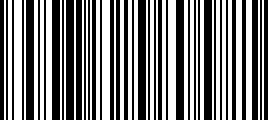
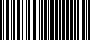
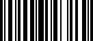

# OutputType


## 

**OutputType** specifies the output type of the **RadBarcode**, currently there are two versions, SVG_VML and EmbeddedPNG. In the first case, the Barcode is rendered as SVG (or VML for IE8 and older).

>note  **RadBarcode** could be exported when is placed within **RadGrid** or **RadTreeList** . Note that Embedded PNG should be set as value of the **OutputType** property.
>


````ASPNET
<telerik:RadBarCode runat="server" OutputType="EmbeddedPNG" LineWidth="1" Type="Code128" Text="1234567">
</telerik:RadBarCode>
````


````ASPNET
<span style="display:inline-block;height:150px;width:300px;" class="RadBarcode"></span> 
````


>caption Image:



Since the dimensions of the rendered image are unknown until it is generated, it is recommend to set**Width=””** and **Height=””**. The image will be seen in its original width and height. The **LineWidth** propertydeterminates the width of the thinnest line in the Barcode in pixels. When rendered as Image, the Barcodecannot be resized smoothly as in vector format like SVG. So if the user needs bigger barcode, it should berendered with higher **LineWidth**. In the example below a **LineWidth=”2”** is used to make the lines thicker. For the **QRCode** mode, there is similar property called **DotSize**, it is accessible from the **QRCodeSettings** collection of settings.

````ASPNET
<telerik:RadBarcode runat="server" OutputType="EmbeddedPNG" Width="" Height="" LineWidth="2" Type="Code128" Text="123">
</telerik:RadBarcode>
````


````ASPNET
<span class="RadBarcode"> 
	 
</span>
````


>caption Image:



In the SVG_VML, the different **LineWidth** will not result in any difference during the rendering.

````ASPNET
<telerik:RadBarcode runat="server" OutputType="SVG_VML" Type="Code128" Text="1234567">
</telerik:RadBarcode>
````


````ASPNET
<span style="display: inline-block; height: 150px; width: 300px;" class="RadBarcode"> 
    <svg height="100%" width="100%" version="1.1" xmlns="http://www.w3.org/2000/svg"> 
        <rect style="fill: rgb(0,0,0)" height="90%" width="2.22%" y="0%" x="0%" /> 
        <rect style="fill: rgb(0,0,0)" height="90%" width="1.11%" y="0%" x="3.33%" /> 
        ..... 
        ..... 
        <rect style="fill: rgb(0,0,0)" height="90%" width="2.22%" y="0%" x="85.55%" /> 
        <rect style="fill: rgb(0,0,0)" height="90%" width="3.33%" y="0%" x="91.11%" /> 
        <rect style="fill: rgb(0,0,0)" height="90%" width="1.11%" y="0%" x="95.55%" /> 
        <rect style="fill: rgb(0,0,0)" height="90%" width="2.22%" y="0%" x="97.77%" /> 
        <text text-anchor="middle" y="100%" x="50%">123456748</text> 
    </svg> 
</span> 
````


>caption Image:



The output image can be generated using GetImage() method of the RadBarcode. It will return a System.Drawing. Bitmap object that the user can save later. The return image size depends on the LineWidth (DotSize) set for the Barcode.


````C#
public void Example()
{    
    RadBarcode barcode = new RadBarcode();
    barcode.Text = "some text";
    barcode.Type = BarcodeType.Code128;
    barcode.LineWidth = 2;
    System.Drawing.Image image = barcode.GetImage();

}
````
````VB.NET
Protected Sub Example()
    Dim barcode As RadBarcode = New RadBarcode()
    barcode.Text = "some text"
    barcode.Type = BarcodeType.Code128
    barcode.LineWidth = 2
    Dim image As System.Drawing.Image = barcode.GetImage()
End Sub
````


## RadBinaryImage and RadBarcode

Radbarcode’s rendered image can be used as DataValue for the RadBinaryImage. Here is an example:


````C#
protected void Page_Load(object sender, EventArgs e)
{
    RadBarcode barcode = new RadBarcode();
    barcode.Text = "some text";
    barcode.Type = BarcodeType.Code128;
    barcode.LineWidth = 2;
    RadBinaryImage image = new RadBinaryImage();
    PlaceHolder1.Controls.Add(image);
    System.IO.MemoryStream stream = new System.IO.MemoryStream();
    barcode.GetImage().Save(stream, System.Drawing.Imaging.ImageFormat.Png);
    image.DataValue = stream.ToArray();
}
````
````VB.NET
Protected Sub Page_Load(ByVal sender As Object, ByVal e As EventArgs)
    Dim barcode As RadBarcode = New RadBarcode()
    barcode.Text = "some text"
    barcode.Type = BarcodeType.Code128
    barcode.LineWidth = 2
    Dim image As RadBinaryImage = New RadBinaryImage()
    PlaceHolder1.Controls.Add(image)
    Dim stream As System.IO.MemoryStream = New System.IO.MemoryStream()
    barcode.GetImage().Save(stream, System.Drawing.Imaging.ImageFormat.Png)
    image.DataValue = stream.ToArray()
End Sub
````


