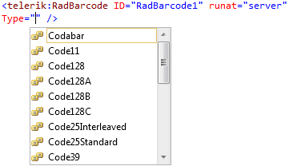

# WebForms Barcode Overview


The **RadBarcode** control can be used for automatic Barcode generation directly from a numeric or character data. It supports several standards that can be used when creating the image.

````ASPX
<%@ Register TagPrefix="telerik" Namespace="Telerik.Web.UI" Assembly="Telerik.Web.UI" %>
 <telerik:RadScriptManager runat="server" ID="RadScriptManager1" />
 <telerik:RadBarcode runat="server" ID="RadBarcode1" Type="EAN13" Height="120px" Text="9780615159591">
 </telerik:RadBarcode>
 <telerik:RadBarcode runat="server" ID="RadBarcode3" Type="QRCode" Height="140px"
     Width="140px" Text="http://www.telerik.com/products/aspnet-ajax/barcode.aspx"
     Style="margin-left: 30px" OutputType="EmbeddedPNG">
     <QRCodeSettings Version="5" DotSize="3" Mode="Byte" />
 </telerik:RadBarcode>
 <telerik:RadBarcode runat="server" ID="RadBarcode2" Type="Code128" Height="120px"
     Text="RadBarcode" Font-Size="16px" Style="margin-left: 30px" ShowChecksum="false">
 </telerik:RadBarcode>
````


>caption List with **standard barcode types** is shown in the screenshot below:


## Properties

After a barcode is added on the page, it is necessary to adjust the basic properties of the barcode,and to specify its type, text and appearance.

* **Type** - Specifies the type of the standard used for encoding the text.

* **Text** -Text that will be encoded with Barcode and rendered in SVG file.

* **Width** - Use for specifying the width of the SVG file and the HTML Span element in which it is wrapped.

* **Height** - Use for specifying the height of the SVG file and the HTML Span element in which it is wrapped.

* **RenderChecksum** - Specifies if the checksum will be rendered in the barcode.

* **ShowChecksum** - Specifies if the checksum should be written under the barcode.

* **ShowText** - Specifies if the text will be shown under the barcode.

* **ShortLinesLengthPercentage** - Specifies the ration between long and short lines in the rendered barcode and adjust the Height and Width of the bars in percentage of the barcode's wrapper. Expects value varies from 0.00 to 100.00 (90 by default).

>note If the value in the **Text** property is invalid for the selected type, the Barcode will not be visible.
>


## See Also

 * [Online Demos](https://demos.telerik.com/aspnet-ajax/barcode/examples/overview/defaultcs.aspx)
 
 * [ASP.NET AJAX Barcode](https://www.telerik.com/products/aspnet-ajax/barcode.aspx)

