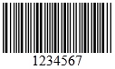
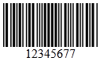
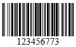
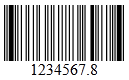
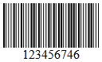
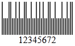
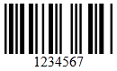
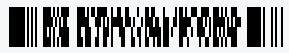

# Types

 

## Codabar

**Codabar** is a discrete, self-checking symbology that may encode 16 different characters,plus an additional 4 start/stop characters.

## Code 11

**Code11** is a barcode symbology which is discrete and is able to encode the numbers 0 through to 9, the dash symbol (-), and start/stop characters

## Code 128

**Code128** is a barcode symbology which encodes alphanumeric characters into a series of bars. It is of variable length, and accepts numbers, upper and lower case characters. It also includes an obligatory MOD 103 checksum.

The Code128 is divided into three subsets A, B, and C. There are three separate start codes to indicate which subset will be used:

1. **Code128A** supports the standard ASCII symbols, numbers, upper case letters, and control characters,such as tab and new-line.

1. **Code128B** supports standard ASCII symbols, numbers, upper and lower case letters.

1. **Code128C** supports numbers only.

## Code 25 Interleaved

**Interleaved 2 of 5** is a higher-density numeric symbology based upon the Standard 2 of 5 symbology.Interleaved 2 of 5 encodes any even number of numeric characters in the widths of the bars and spacesof the bar code.Unlike Standard 2 of 5, which only encodes information in the width of the bars,Interleaved 2of 5 encodes data in the width of both the bars and spaces. This allows Interleaved 2 of 5 to achieve a somewhat higher density.The symbology is called "interleaved" because the first numeric data is encodedin the first 5 bars while the second numeric data is encoded in the first 5 spaces that separate thefirst 5 bars.Thus the first 5 bars and spaces actually encode two characters. This is also why the bar codecan only encode an even number of data elements.

## Code 25 Standard

**Stanadard 2 of 5** is a low-density numeric symbology. The spaces in the barcode exist only toseparate the bars themselves. Additionally, a bar may either be wide or narrow, a wide bar generally being 3 times as wide as a narrow bar. The exact size of the spaces is not critical, but is generallythe same width as a narrow bar.

## Code 39

**Code39** is a barcode symbology which encodes alphanumeric characters into a series of bars. It is of variable length and accepts uppercase letters, as well as numbers.It includes an optionalMod 43 checksum. **Code39Extended** is an exteded version of code 39, which includes a bigger character set. If there is a requirement to use the Code39 barcode with characters other than numbers and uppercase alphabets, then this is therecommended barcode.

## Code 93

**Code93** was designed to complement and improve upon Code 39. Code 93 is similar in that it,like Code 39, can represent the full ASCII character set by using combinations of 2 characters.It differs in that Code 93 is a continuous symbology and produces denser code. It also encodes 47characters compared to Code 39's 43 characters. **Code93Extended** is an exteded version of code 93, which includes a bigger character set. Code93Extended can encode full 128 character ASCIIusing the four additional characters: ($) (%) (/) (+)

## EAN 13

**EAN13** is a barcode symbology which encodes numbers into a series of bars.It is of fixed length, of 13 digit (12 data and 1 check), and accepts numbers. First digit is always placed outside the symbol; additionally a right quiet zone indicator **(>)** is used to indicate Quiet Zones that are necessary for barcode scanners to work properly. It includes a checksum.

## EAN 8

**EAN8** is a barcode symbology which encodes numbers into a series of bars. It is of fixed length, of 7 digits, and accepts numbers only. It includes a checksum.

## MSI

**MSI**(also known as Modified Plessey) is a barcode symbology is a continuous, non-self-checking symbology.It is used primarily for inventory control, marking storage containers and shelves in warehouse environments. The length of this barcode type is variable.

The MSI barcode uses one of four possible schemes for calculating a check digit:

1. **MSImod10**(most common)

1. **MSImod1010**

1. **MSImod11**

1. **MSImod1110**

## Postnet

**Postnet**(Postal Numeric Encoding Technique) is a barcode symbology which encodes numbers into a series of bars. It is of variable lengthand accepts numbers only. It includes a checksum.

## UPC-A

**UPCA** is a barcode symbology, which consists of 12 digits, one of which is a checksum. This barcode identifies the manufacturer and specific product, so point-of- sale cash register systems can automatically look up the price.

## UPC-E

**UPCE** is a variation of the UPCA symbol that is used for number system 0. By suppressing zeroes, UPCE codes can be printedin a very small space and are used for labeling small items.

## UPC Supplement 2

A two digit UPC supplementary code. This barcode should only be used with magazines, newspapers and other such periodicals.

## UPC Supplement 5

A five digit UPC supplementary code. This barcode is used on books to indicate a suggested retail price.

## PDF417

This standard works in both EmbeddedPNG and SVG_VML output types and behaves similar to the other barcode standards. Additionally there are 3 more settings to configure:

1.AspectRatio - Integer - Specify the ratio between width and height of the lines. Should be at least 3, to be valid for most scanners.
2.EncodingMode - Enum - (Auto, Byte, Text, Numeric) - By default is Byte, and specify the encoding mode according to the PDF417 standards.
3.ErrorCorrectionLevel - Integer.

