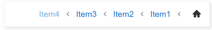

# Right-to-left Support

The RadBreadcrumb supports right-to-left (RTL) language locales. In order to turn on the RTL support, you should set the *dir="rtl"* and add the *"k-rtl"* class to the parent element of the Control. The *"k-rtl"* class is needed to ensure the proper orientation of the Icons.

For example you can wrap the Breadcrumb in a &lt;div dir="rtl" class="k-rtl"&gt; element:



````ASPX
<div dir="rtl" class="k-rtl">
    <telerik:RadBreadcrumb runat="server" ID="RadBreadcrumb2">
        <Items>
            <telerik:BreadcrumbItem Type="RootItem" Text="Root Item" />
            <telerik:BreadcrumbItem Text="Item1" />
            <telerik:BreadcrumbItem Text="Item2" />
            <telerik:BreadcrumbItem Text="Item3" />
            <telerik:BreadcrumbItem Text="Item4" />
        </Items>
    </telerik:RadBreadcrumb>
</div
````


# See Also

 * [Right-to-Left Support demo](https://demos.telerik.com/aspnet-ajax/breadcrumb/accessibility-and-internationalization/rtl/defaultcs.aspx)
 

