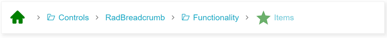

# Icons

The Breadcrumb allows configuring the icons of the items and the delimiters. All the built-in icons distributed with Telerik UI for ASP.NET AJAX suite can be used in **RadBreadcrumb**.

In addition, all the [Kendo UI Web Font Icons](https://docs.telerik.com/kendo-ui/styles-and-layout/icons-web#list-of-font-icons) are also available for using in the component.

To include a desired embedded icon use the exposed icon properties - `RootIcon`, `DelimiterIcon` of the **RadBreadcrumb**, or `Icon` and `IconClass` of each **BreadcrumbItem**.

>caption Figure 1:


## Root Icon

The root icon is the icon rendered in the RootItem. It is clickable and resets the value of the component when clicked.

>caption Figure 2:


>note By default the RootIcon is visible. It can be hidden by setting the `ShowIcon` property of the RootItem to *'false'* 

The icon of the RootItem can be set via the `RootIcon` property of the **RadBreadcrumb** like shown in **Figure 2** above:

````ASPX
<telerik:RadBreadcrumb runat="server" ID="RadBreadcrumb1" RootIcon="user">
    <Items>
        <telerik:BreadcrumbItem Type="RootItem" ToolTip="My Profile" />
        <telerik:BreadcrumbItem Text="Settings" />
        <telerik:BreadcrumbItem Text="Security" />
    </Items>
</telerik:RadBreadcrumb>
````

The same result can be achieved by setting the `Icon` property of the respective **BreadcrumbItem**

````ASPX
<telerik:RadBreadcrumb runat="server" ID="RadBreadcrumb1">
    <Items>
        <telerik:BreadcrumbItem Type="RootItem" ToolTip="My Profile" Icon="user" />
        <telerik:BreadcrumbItem Text="Settings" />
        <telerik:BreadcrumbItem Text="Security" />
    </Items>
</telerik:RadBreadcrumb>
````

In case the `RootIcon` is not set explicitly, it gets its default value - "home"

>note If different icons are set to the `RootIcon` property of the **RadBreadcrumb** and to the `Icon` property of **BreadcrumbItem** with type RootItem, the one set to the Item takes effect.

## Delimiter Icon

The delimiter icon is the icon rendered between the items in the Breadcrumb. It can be set via the `DelimiterIcon` property of the Breadcrumb. Check out the sample declaration and **Figure 3** below:

````ASPX
<telerik:RadBreadcrumb runat="server" ID="RadBreadcrumb2" DelimiterIcon="divide">
    <Items>
        <telerik:BreadcrumbItem Type="RootItem" />
        <telerik:BreadcrumbItem Text="Item 1" />
        <telerik:BreadcrumbItem Text="Item 2" />
        <telerik:BreadcrumbItem Text="Item 3" />
    </Items>
</telerik:RadBreadcrumb>
````

>caption Figure 3:


## Item Icon

The icons rendered for each item. It is also clickable and can be configured through the `Icon` property of **BreadcrumbItem**.

By default, the Item icon is not visible (despite for RootItems). To show the icon for an item set its `ShowIcon` property to *'true'*, like demonstrated below:

````ASPX
<telerik:RadBreadcrumb runat="server" ID="RadBreadcrumb1" >
    <Items>
        <telerik:BreadcrumbItem Type="RootItem" />
        <telerik:BreadcrumbItem Text="Item 1" Icon="folder-open" ShowIcon="true" />
        <telerik:BreadcrumbItem Text="Item 2" Icon="star" ShowIcon="true" />
        <telerik:BreadcrumbItem Text="Item 3" Icon="circle" ShowIcon="true"/>
    </Items>
</telerik:RadBreadcrumb>
````

>caption Figure 4:


## Use Class names to apply icons

In case the name of a desired icon is not part of the predifined built-in icons, you can use the icon properties and set a Class name instead.

>caution
To set a Class name for the `RootIcon` and `DelimiterIcon` **RadBreadcrumb** properties, or for the `Icon` property of a **BreadcrumbItem** you need to set the desired Class name with a foregoing whitespace character(e.g. RootIcon=" k-i-globe-outline").
>

We can use that approach to apply a desired Kendo Web Font Icon in **RadBreadcrumb** like demonstrated in the figure below:

>caption Figure 5:


We would need to get the Unicode of the desired icon from the [Kendo Icons page](https://docs.telerik.com/kendo-ui/styles-and-layout/icons-web#list-of-font-icons) and set it as content of the before pseudo-element.

The declaration of the Breadcrumb shown in **Figure 5**:

````ASPX
<style>
    .k-i-arrow-right:before {
        content: "\e018";
    }

    .k-i-globe-outline:before {
        content: "\e700";
    }

    .k-i-attachment.k-i-clip:before {
        content: "\e10d";
    }
</style>

<telerik:RadBreadcrumb runat="server" ID="RadBreadcrumb2" DelimiterIcon=" k-i-arrow-right" RootIcon=" k-i-globe-outline">
    <Items>
        <telerik:BreadcrumbItem Type="RootItem" />
        <telerik:BreadcrumbItem Text="Item 1" />
        <telerik:BreadcrumbItem Text="Item 2" />
        <telerik:BreadcrumbItem Text="Item 3" ShowIcon="true" Icon=" k-i-attachment k-i-clip" />
    </Items>
</telerik:RadBreadcrumb>
````

For Item icons, another way to achieve the same is to set the *k-icon* class to the `IconClass` property followed by the icon class names:

````
<telerik:BreadcrumbItem Text="Item 3" ShowIcon="true" IconClass="k-icon k-i-attachment k-i-clip" />
````

Find more about the usage of the `IconClass` property in the next section.


## Use the IconClass

The `IconClass` property of **RadBreadcrumb** defines additional classes that will be applied to the &lt;span&gt; containing the font icon. That way each icon can be reached and styled separately.

Sample usage of the `IconClass` property is shown in **Figure 6** below:

>caption Figure 6:



And the code to achieve this appearance:

````ASPX
<telerik:RadBreadcrumb runat="server" ID="RadBreadcrumb2" Skin="Silk" >
    <Items>
        <telerik:BreadcrumbItem Type="RootItem" IconClass="largeGreenIcon" />
        <telerik:BreadcrumbItem Text="Controls" ShowIcon="true" Icon="folder-open"  />
        <telerik:BreadcrumbItem Text="RadBreadcrumb" />
        <telerik:BreadcrumbItem Text="Functionality" ShowIcon="true" Icon="folder-open" />
        <telerik:BreadcrumbItem Text="Items" Icon="star" ShowIcon="true" IconClass="largeGreenIcon" />
    </Items>
</telerik:RadBreadcrumb>
<style>
    .largeGreenIcon {
        font-size: 2em;
        color: green;
    }
</style>
````
 
Go ahead and test the [Icons live demo](https://demos.telerik.com/aspnet-ajax/breadcrumb/functionality/icons/defaultcs.aspx). 

In case you want to replace the built-in icons with external ones, check out [How to Integrate RadBreadcrumb with FontAwesome icons](%slug breadcrumb/how-to/how-to-integrate-radbreadcrumb-with-fontawesome-icons%)


# See Also

 * [Icons live demo](https://demos.telerik.com/aspnet-ajax/breadcrumb/functionality/icons/defaultcs.aspx)
 * [How to Integrate RadBreadcrumb with FontAwesome icons]()
 * [Kendo UI Web Font Icons](https://docs.telerik.com/kendo-ui/styles-and-layout/icons-web#list-of-font-icons)


