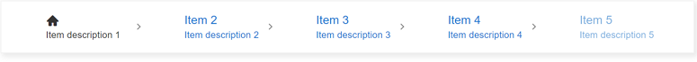

# Items

**RadBreadcrumb** exposes two main item types - **RootItem** and default **Item**. 

Each **BreadcrumbItem** can be customized by setting its various properties.

>caption Figure 1:


The RadBreadcrumb items can be defined declaratively in the markup in the &lt;Items&gt; tag:

````ASPX
<telerik:RadBreadcrumb ID="RadBreadcrumb1" runat="server">
    <Items>
        <telerik:BreadcrumbItem Type="RootItem" Text="Root item" />
        <telerik:BreadcrumbItem Text="Item 1" />
        <telerik:BreadcrumbItem Text="Item 2" />
    </Items>
</telerik:RadBreadcrumb>
````

They can also be added programaticaly in the Items collection of the RadBreadcrumb control:

````C#
BreadcrumbItem item = new BreadcrumbItem();
item.Type = BreadcrumbItemType.Item;
item.Text = "Item 3";
RadBreadcrumb1.Items.Add(item);
````
````VB
Dim item As BreadcrumbItem = New BreadcrumbItem()
item.Type = BreadcrumbItemType.Item
item.Text = "Item 3"
RadBreadcrumb1.Items.Add(item)
````

## Main properties

* `Type` - Specifies if the **BreadcrumbItemType** is **Item**(default) or **RootItem**. 

    * **RootItem** - renders the item with an icon and no text.
    * **Item** - renders the items with text and no icon.

* `Text` - Defines the text of the item. If set, its value is also applied as a tooltip of the item.
* `Icon` - Defines the icon to be rendered. Gets a string value corresponding to a class from the [Kendo UI Web Font Icons](https://docs.telerik.com/kendo-ui/styles-and-layout/icons-web#list-of-font-icons). Find more related information in the [Icons]() section.
* `Href` - Defines the navigation link's URL of the item. The Href is applied only if the **Navigational** property of the **RadBreadcrumb** is set to *'true'*.
* `Disabled` - Defines whether the item is disabled.
* `ToolTip` - Defines the title of the item that will be used as a tooltip. 

>caption Appearance properties

* `ShowText` - Defines whether to show the text. The default value is *'false'* for **RootItem** and *'true'* for **Item**.
* `ShowIcon` - Defines whether to show the icon. The default value is *'true'* for **RootItem** and *'false'* for **Item**.
* `ItemClass` - Defines the item classes (applies to the rendered &lt;li&gt; element).
* `LinkClass` - Defines the link classes (applies to the &lt;a&gt; element).
* `IconClass`- Defines the icon classes (applies to the &lt;span&gt; element).


A sample with some of the Item's properties in use is shown in **Figure 2** below:

>caption Figure 2:


````ASPX
<telerik:RadBreadcrumb runat="server" ID="RadBreadcrumb1" Skin="Silk" Navigational="true">
    <Items>
        <telerik:BreadcrumbItem Type="RootItem" Text="Telerik UI" ShowText="true" Icon="pin" ItemClass="customRootItem" ToolTip="Home page" Href="https://docs.telerik.com/devtools/aspnet-ajax/" />
        <telerik:BreadcrumbItem Text="Controls" ShowIcon="true" Icon="folder-open" Disabled="true" IconClass="customIcon" Href="/controls" />
        <telerik:BreadcrumbItem Text="RadBreadcrumb" Href="https://docs.telerik.com/devtools/aspnet-ajax/controls/breadcrumb/overview" />
        <telerik:BreadcrumbItem Text="Functionality" ShowIcon="true" Icon="folder-open" Disabled="true"  Href="/functionality" />
        <telerik:BreadcrumbItem Text="Items" Icon="star" ShowIcon="true" Href="/items" />
    </Items>
</telerik:RadBreadcrumb>
````
````CSS
.customRootItem {
    font-weight: 900;
    color: #ff6358;
}

.customIcon {
    font-size: 2em;
}
````

>caption RootTilte

For RootItems, where no text is rendered by default, setting a title (ToolTip) can also be done by using the **MessageSettings.RootTitle** property of the RadBreadcrumb. The RootTitle can be declared in the markup inside the &lt;MessageSettings&gt; inner tag:

````ASPX
<telerik:RadBreadcrumb runat="server" ID="RadBreadcrumb1">
    <MessagesSettings RootTitle="Home page" />
````

>note The RootTitle set in the MessagesSettings takes efect only if RootItem has no values assigned to its Text and ToolTip properties.

## ClientItemTemplate

**RadBreadcrumb** uses [Kendo UI Templates](https://docs.telerik.com/kendo-ui/framework/templates/overview) to provide full control over the rendering of the items.

The default appearance of the Breadcrumb Control can be achieved with the template declaration shown below. It can serve as a convenient basis for further modifications:

````ASPX
<telerik:RadBreadcrumb runat="server" ID="RadBreadcrumb1" OnDataBinding="RadBreadcrumb1_DataBinding">
    <ClientItemTemplate>
        <li class="k-breadcrumb-item #:itemClass# #if(lastSegment){#k-breadcrumb-last-item#}#">
            <a href="#:href#" 
            class="#:linkClass# #if(type !== "rootitem"){# k-breadcrumb-link#}#
            #if(showText && showIcon){# k-breadcrumb-icontext-link #}#
            #if(showIcon && !showText){# k-breadcrumb-icon-link #}#
            #if((lastSegment && type !== "rootitem")||disabled){# k-state-disabled#}#"
            #if(lastSegment){# aria-current="page"#}# 
            title="#:text || title#">
                    
                #if(showIcon) {#<span class="#if(icon){#k-icon k-i-#:icon##}# #:iconClass#"></span>#}#
                #if(showText) {##:text##}#
            </a>                    
            #if(renderDelimiter) {#<span class="k-breadcrumb-delimiter-icon k-icon k-i-#:delimiterIcon#" aria-hidden="true"></span>#}#
            #if(type === "rootitem" && renderDelimiter) {#<span class="k-breadcrumb-delimiter-icon k-hidden k-icon k-i-#:delimiterIcon#" aria-hidden="true"></span>#}#
        </li>
    </ClientItemTemplate>
</telerik:RadBreadcrumb>
````
````C#
protected void Page_Load(object sender, EventArgs e)
{
    if (!IsPostBack)
    {
        RadBreadcrumb1.DataBind();
    }
}

protected void RadBreadcrumb1_DataBinding(object sender, EventArgs e)
{
    (sender as RadBreadcrumb).Items.AddRange(GetBreadcrumbItems(null));
}

private IEnumerable<BreadcrumbItem> GetBreadcrumbItems(object dataSource)
{
    var result = new List<BreadcrumbItem>();

    for (int i = 0; i < 5; i++)
    {
        var index = i + 1;
        var breadcrumbItem = new BreadcrumbItem() { Text = "Item " + index, Href = "/Item " + index };
        result.Add(breadcrumbItem);
    }
    result[0].Type = BreadcrumbItemType.RootItem;

    return result;
}
````
````VB
 Protected Sub Page_Load(ByVal sender As Object, ByVal e As EventArgs)
        If Not IsPostBack Then
            RadBreadcrumb1.DataBind()
        End If
    End Sub

    Protected Sub RadBreadcrumb1_DataBinding(ByVal sender As Object, ByVal e As EventArgs)
        (TryCast(sender, RadBreadcrumb)).Items.AddRange(GetBreadcrumbItems(Nothing))
    End Sub

    Private Function GetBreadcrumbItems(ByVal dataSource As Object) As IEnumerable(Of BreadcrumbItem)
        Dim result = New List(Of BreadcrumbItem)()

        For i As Integer = 0 To 5 - 1
            Dim index = i + 1
            Dim breadcrumbItem = New BreadcrumbItem() With {
                .Text = "Item " & index,
                .Href = "/Item " & index
            }
            result.Add(breadcrumbItem)
        Next

        result(0).Type = BreadcrumbItemType.RootItem
        Return result
    End Function
````

The result from the declaration above should be the same as if ClientItemTemplate is not in use, see **Figure 3** below:

>caption Figure 3:


We can modify the default template (the one above) and customize it to achieve the desired appearance. 

In the sample below, a new custom attribute is added to each item and the same is included in the customized template structure:

>caption Figure 4:



Here is the code leading to the appearance shown in **Figure 4**:

````ASPX
<telerik:RadBreadcrumb runat="server" ID="RadBreadcrumb1" OnDataBinding="RadBreadcrumb1_DataBinding">
    <ClientItemTemplate>
            <li class="k-breadcrumb-item #:itemClass# #if(lastSegment){#k-breadcrumb-last-item#}#">
                <a href="#:href#" 
                class="#:linkClass# #if(type !== "rootitem"){# k-breadcrumb-link#}#
                #if(showText && showIcon){# k-breadcrumb-icontext-link #}#
                #if(showIcon && !showText){# k-breadcrumb-icon-link #}#
                #if((lastSegment && type !== "rootitem")||disabled){# k-state-disabled#}#"
                #if(lastSegment){# aria-current="page"#}# 
                title="#:text || title#">

                <ul style="list-style-type:none;">
                    #if(showIcon) {#<li><span class="#if(icon){#k-icon k-i-#:icon##}# #:iconClass#"></span></li>#}#
                    #if(showText) {#<li>#:text#</li>#}#
                    #if(data.attributes){ #<li style="font-size:0.8em;">#: data.attributes['Description'] #</li># }#
                </ul>
                </a>
            #if(renderDelimiter) {#<span class="k-breadcrumb-delimiter-icon k-icon k-i-#:delimiterIcon#" aria-hidden="true"></span>#}#
            #if(type === "rootitem" && renderDelimiter) {#<span class="k-breadcrumb-delimiter-icon k-hidden k-icon k-i-#:delimiterIcon#" aria-hidden="true"></span>#}#
            </li>
    </ClientItemTemplate>
</telerik:RadBreadcrumb>
````
````C#
protected void Page_Load(object sender, EventArgs e)
{
    if (!IsPostBack)
    {
        RadBreadcrumb1.DataBind();
    }
}

protected void RadBreadcrumb1_DataBinding(object sender, EventArgs e)
{
    (sender as RadBreadcrumb).Items.AddRange(GetBreadcrumbItems(null));
}

private IEnumerable<BreadcrumbItem> GetBreadcrumbItems(object dataSource)
{
    var result = new List<BreadcrumbItem>();

    for (int i = 0; i < 5; i++)
    {
        var index = i + 1;
        var breadcrumbItem = new BreadcrumbItem() { Text = "Item " + index, Href = "/Item " + index };
        //additional attribute that can be used in the ClientItemTemplate
        breadcrumbItem.Attributes.Add("Description", "Item description " + index);
        result.Add(breadcrumbItem);
    }
    result[0].Type = BreadcrumbItemType.RootItem;

    return result;
}
````
````VB
 Protected Sub Page_Load(ByVal sender As Object, ByVal e As EventArgs)
        If Not IsPostBack Then
            RadB    readcrumb1.DataBind()
        End If
    End Sub

    Protected Sub RadBreadcrumb1_DataBinding(ByVal sender As Object, ByVal e As EventArgs)
        (TryCast(sender, RadBreadcrumb)).Items.AddRange(GetBreadcrumbItems(Nothing))
    End Sub

    Private Function GetBreadcrumbItems(ByVal dataSource As Object) As IEnumerable(Of BreadcrumbItem)
        Dim result = New List(Of BreadcrumbItem)()

        For i As Integer = 0 To 5 - 1
            Dim index = i + 1
            Dim breadcrumbItem = New BreadcrumbItem() With {
                .Text = "Item " & index,
                .Href = "/Item " & index
            }
            'additional attribute that can be used in the ClientItemTemplate
            breadcrumbItem.Attributes.Add("Description", "Item description " & index)
            result.Add(breadcrumbItem)
        Next

        result(0).Type = BreadcrumbItemType.RootItem
        Return result
    End Function
````

 
# See Also

 * [ClientItemTemplate live demo](https://demos.telerik.com/aspnet-ajax/breadcrumb/functionality/clienttemplate/defaultcs.aspx)
 * [Kendo UI Templates](https://docs.telerik.com/kendo-ui/framework/templates/overview)


