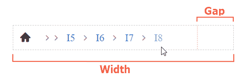

# Overflowing 

When the width of the RadBreadcrumb is not enough to display the entire path, the widget will show only the items that fit the available space. The rest will be hidden. If you click one of the visible items, the value of the widget will change and reveal the previously hidden item.

The width of the Breadcrumb can be set in the `Width` property.

Sample of overflowing RadBreadcrumb:


````ASPX
<telerik:RadBreadcrumb runat="server" ID="RadBreadcrumb1" Width="300">
    <Items>
        <telerik:BreadcrumbItem Type="RootItem" Text="Root Item" />
        <telerik:BreadcrumbItem Text="Item1" />
        <telerik:BreadcrumbItem Text="Item2" />
        <telerik:BreadcrumbItem Text="Item3" />
        <telerik:BreadcrumbItem Text="Item4" />
        <telerik:BreadcrumbItem Text="Item5" />
        <telerik:BreadcrumbItem Text="Item6" />
    </Items>
</telerik:RadBreadcrumb>
````

>caption Defining a Gap

 By setting the `Gap` property of RadBreadcrumb you can define the space in pixels after the last item to stay empty. The gap value is taken into account when items overflow and continue to remain empty.

````ASPX
<telerik:RadBreadcrumb runat="server" ID="RadBreadcrumb1" Width="300" Gap="50">
````

 


 