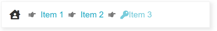

# How to Integrate RadBreadcrumb with FontAwesome icons

This article explains how to use FontIcons in the Breadcrumb component.

>caption Figure 1:



For the successful integration of the FontAwesome glyphs as RadBreadcrumb icons you need to follow a few simple steps:

## Include Font Awesome on the page

Here are some of the possible options to do it:

- Get a personal Kit code - [Get started with FontAwesome](https://fontawesome.com/start)
- Download and host Font Awesome locally - [Hosting Font Awesome Yourself](https://fontawesome.com/how-to-use/on-the-web/setup/hosting-font-awesome-yourself)
- Using a Content Delivery Network (CDN)

For the of sample in the article, a Kit code is placed in the \<body> tag. 

````
<body>
    <script src="https://kit.fontawesome.com/xxxxxxxxxx.js" crossorigin="anonymous"></script>
````

>note Referencing Font Awesome inside the \<body> tag will not allow the built-in Telerik styles to override the third party stylesheets.

## Use Font Awesome icon as ItemIcon or RootIcon

Set the desired Font Awesome class to the `ItemClass` property of the desired **BreadcrumbItem** and ensure the `ShowIcon` property is set to *'true'* (for RootItem, `ShowIcon` is true by default). Check out how to use the Font Awesome classes in the [Font Awesome - Basic Use]("https://fontawesome.com/how-to-use/on-the-web/referencing-icons/basic-use") article.

````ASPX
<telerik:BreadcrumbItem Type="RootItem" IconClass="fas fa-house-user" />
<telerik:BreadcrumbItem Text="Item 1" ShowIcon="true" IconClass="fas fa-key" />
````

## Use Font Awesome icon as DelimiterIcon

To use a third party font icon as a delimiter you need to override the styles applying the built-in one. Adding Font Awesome icon in this case would require using the [CSS Pseudo-elements]("https://fontawesome.com/how-to-use/on-the-web/advanced/css-pseudo-elements").

Sample CSS to change the DelimiterIcon:

````CSS
.RadBreadcrumb .k-icon.k-breadcrumb-delimiter-icon {
    font-family: "Font Awesome 5 Free";
    font-weight: 900;
}
    .RadBreadcrumb .k-icon.k-breadcrumb-delimiter-icon:before {
        content: "\f0a4"
    }
````

## Example

Here is the complete declaration to achieve the RadBreadcrumn shown in ***Figure 1*** :

````ASPX
<style>
    .RadBreadcrumb .k-icon.k-breadcrumb-delimiter-icon {
        font-family: "Font Awesome 5 Free";
        font-weight: 900;
    }
        .RadBreadcrumb .k-icon.k-breadcrumb-delimiter-icon:before {
            content: "\f0a4"
        }
</style>
<telerik:RadBreadcrumb runat="server" ID="RadBreadcrumb2" Skin="Silk">
    <Items>
        <telerik:BreadcrumbItem Type="RootItem" IconClass="fas fa-house-user" />
        <telerik:BreadcrumbItem Text="Item 1" />
        <telerik:BreadcrumbItem Text="Item 2" />
        <telerik:BreadcrumbItem Text="Item 3" ShowIcon="true" IconClass="fas fa-key" />
    </Items>
</telerik:RadBreadcrumb>
````

 
# See Also

 * [Icons]()


